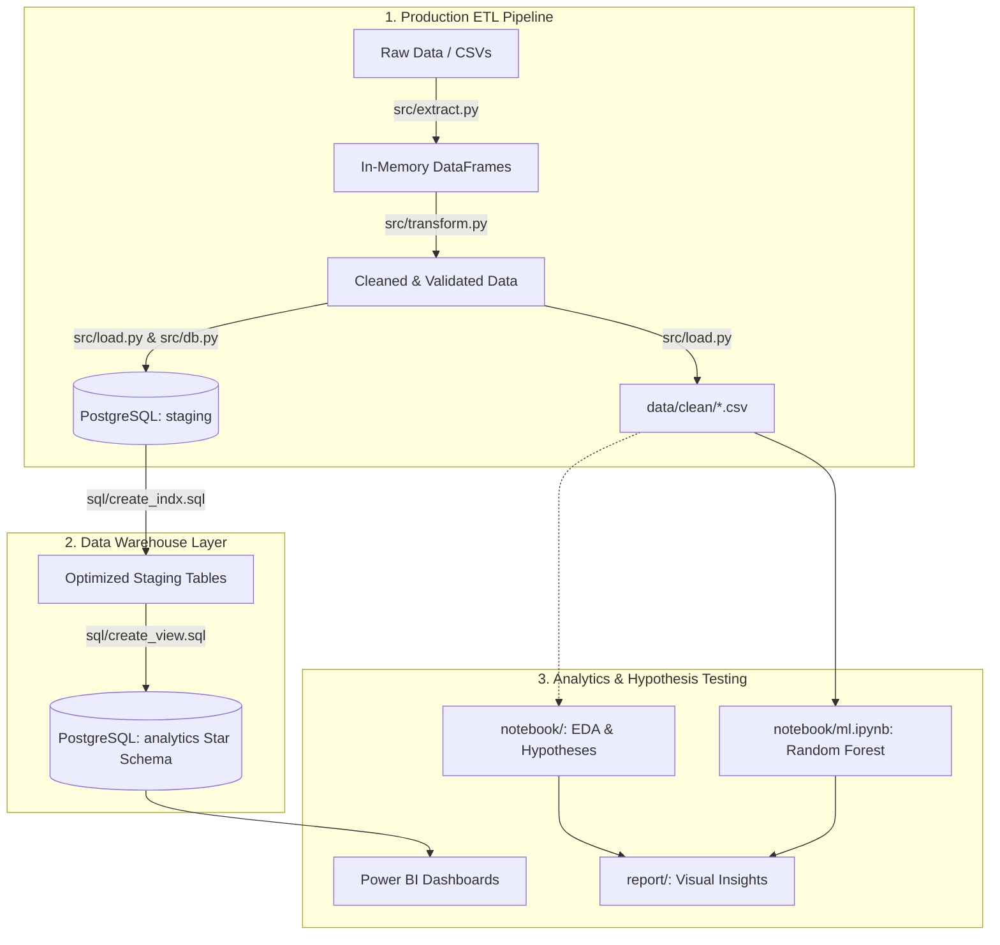
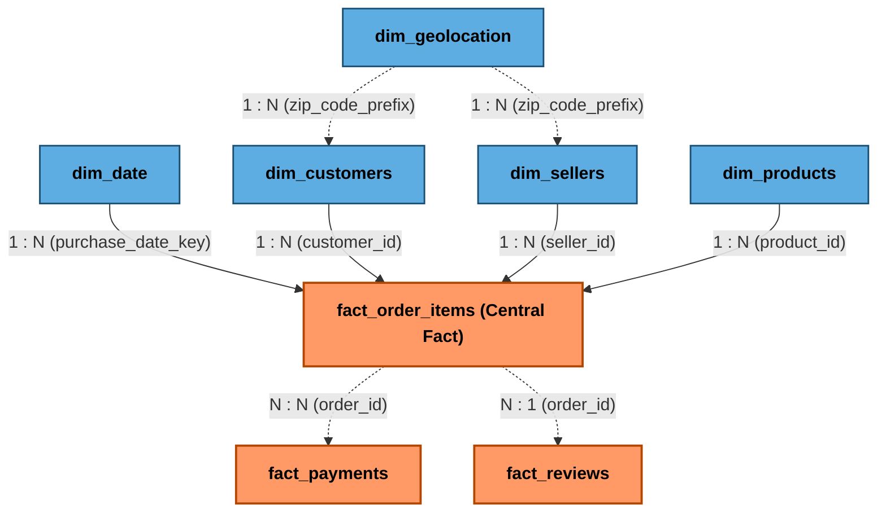

# Olist Brazilian E-Commerce Analytics & Machine Learning Pipeline

Du an phan tich du lieu toan dien (End-to-End Analytics & Data Warehousing) tren bo du lieu thuong mai dien tu **Olist (Brazil)** gom hon 100.000 don hang tu nam 2016 den 2018. 

Du an duoc phan tach ro rang theo chuan cong nghiep:
- **`src/`**: Pipeline ETL (Extract - Transform - Load) dang module hoa trong Python, tu dong hoa toan bo qua trinh lam sach du lieu, kiem tra rang buoc toan ven va nap vao PostgreSQL.
- **`notebook/`**: Danh rieng cho nghien cuu tham do (Exploratory Data Analysis - EDA), kiem chung cac gia thuyet kinh doanh va thu nghiem mo hinh Machine Learning.
- **`sql/`**: Data Warehouse kien truc Star Schema (Dimension, Fact, Master Views) toi uu chi muc B-Tree tren PostgreSQL.
- **`report/`**: Truc quan hoa bao cao phan tich va theo doi cac chi so KPI.

---

## Muc Luc
1. [Tong quan du an](#1-tong-quan-du-an)
2. [Kien truc luong xu ly (Architecture)](#2-kien-truc-luong-xu-ly-architecture)
3. [Cau truc thu muc (Project Structure)](#3-cau-truc-thu-muc-project-structure)
4. [Mo hinh du lieu (Data Modeling & Database Design)](#4-mo-hinh-du-lieu-data-modeling--database-design)
5. [Pipeline ETL trong `src/`](#5-pipeline-etl-trong-src)
6. [Khu vuc Nghien cuu & Gia thuyet trong `notebook/`](#6-khu-vuc-nghien-cuu--gia-thuyet-trong-notebook)
7. [Cong nghe & Thu vien su dung (Tech Stack)](#7-cong-nghe--thu-vien-su-dung-tech-stack)
8. [Huong dan cai dat & Chay du an (Getting Started)](#8-huong-dan-cai-dat--chay-du-an-getting-started)

---

## 1. Tong quan du an

- **Bo du lieu**: Brazilian E-Commerce Public Dataset by Olist (9 bang du lieu quan he: Don hang, Khach hang, Nguoi ban, San pham, Danh gia, Thanh toan, Danh muc, Toa do dia ly).
- **Muc tieu**:
  - Tu dong hoa pipeline ETL lam sach va nap 9 tap du lieu sach vao CSDL PostgreSQL mot cach nhat quan.
  - Xay dung kho du lieu phan lop (`staging` va `analytics`) phuc vu bao cao da chieu.
  - Phan tich kham pha va kiem chung cac gia thuyet ve doanh thu, logistics va do hai long cua khach hang.
  - Du doan don hang co nguy co giao tre bang thuat toan Random Forest.

---

## 2. Kien truc luong xu ly (Architecture)



---

## 3. Cau truc thu muc (Project Structure)

```text
olist-ecommerce-analytics/
|
+-- main.py                     # Diem chay chinh (Entrypoint) cho toan bo Pipeline ETL
+-- requirements.txt            # Danh sach cac thu vien Python phu thuoc
+-- .env                        # Cau hinh bien moi truong ket noi Database (Host, Port, User, Password)
+-- README.md                   # Tai lieu chi tiet ve du an
|
+-- data/                       # Thu muc du lieu
|   +-- raw/                    # 9 tep du lieu tho goc tu Olist
|   +-- clean/                  # 9 tep du lieu sau khi duoc pipeline xu ly sach
|
+-- src/                        # CORE ETL ENGINE (Production Pipeline)
|   +-- __init__.py             # Khoi tao package va cau hinh UTF-8 console
|   +-- config.py               # Thiet lap duong dan, anh xa 27 bang, cau hinh DB
|   +-- extract.py              # Doc du lieu tho tu data/raw/
|   +-- transform.py            # Tien xu ly, chuan hoa, loc di biet & kiem tra toan ven (FK)
|   +-- load.py                 # Luu tru data/clean/ & nap vao PostgreSQL schema staging
|   +-- db.py                   # Quan ly ket noi DB, kiem thu & thuc thi DDL/Views SQL
|   +-- pipeline.py             # Dieu phoi (Orchestrator) toan bo luong ETL kem CLI flags
|
+-- database/                   # Scripts ho tro thao tac CSDL phu tro
|   +-- connect_db.py           # Module ket noi co so du lieu
|   +-- load_to_postgres.py     # Script nap du lieu doc lap
|
+-- sql/                        # Kich ban SQL dinh nghia Data Warehouse
|   +-- create_db.sql           # DDL tao schema staging, 9 bang quan he & Foreign Keys
|   +-- create_indx.sql         # Tao chi muc B-Tree toi uu hoa hieu nang truy van
|   +-- create_view.sql         # Tao mo hinh Star Schema (Dim, Fact) & Master View
|
+-- notebook/                   # NGHIEN CUU & KIEM CHUNG GIA THUYET (Jupyter)
|   +-- undertand_data.ipynb    # Kham pha cau truc, phan bo va cac van de cua du lieu tho
|   +-- cleaning_data.ipynb     # Notebook thu nghiem cac buoc tien xu ly truoc khi dong goi vao src/
|   +-- eda_123.ipynb           # Kiem chung gia thuyet ve Doanh thu, Xu huong thoi gian, Pareto 80/20
|   +-- eda_456.ipynb           # Kiem chung gia thuyet ve Van chuyen/Logistics & Diem danh gia Review
|   +-- ml.ipynb                # Thu nghiem mo hinh Machine Learning du doan giao hang tre
|
+-- report/                     # Bao cao phan tich & Danh gia Machine Learning
    +-- README.md               # Muc luc tong quan bao cao
    +-- business/               # Phan tich kinh doanh, Doanh thu, Khach hang, Logistics
    |   +-- README.md           # Bao cao chi tiet EDA & Business Insights
    |   +-- images/             # 18 bieu do phan tich kinh doanh (.png)
    +-- ml/                     # Danh gia mo hinh Machine Learning
        +-- README.md           # Bao cao chi tiet mo hinh Random Forest
        +-- images/             # 4 bieu do danh gia mo hinh ML (.png)
```

---

## 4. Pipeline ETL trong `src/`

Pipeline duoc thiet ke theo nguyen ly mo-dun hoa cao (High Cohesion, Loose Coupling):

1. **`extract.py`**:
   - Quet va nap toan bo 9 tep du lieu tho tu `data/raw/` vao bo nho.
2. **`transform.py`**:
   - Chuan hoa kieu ngay gio `datetime64[ns]` tren toan bo cac cot thoi gian.
   - Xu ly cac gia tri khuyet thieu (`reviews`, `products`).
   - Xu ly bat thuong thanh toan (loai bo `payment_type = 'not_defined'`, chuan hoa ky tra gop).
   - Dong bo danh muc dich thuat tieng Anh (`category_translation`).
   - Chuyen doi ma 27 bang viet tat sang ten day du (`SP` -> `São Paulo`).
   - Khu trung lap va loai bo toa do ngoai lai ngoai lanh tho Brazil (`geolocation`).
   - **Tu dong kiem tra rang buoc toan ven tham chieu (Foreign Key Integrity)**: Dam bao 100% khong co ban ghi mo coi (orphan records) giua cac bang lien ket.
3. **`load.py`**:
   - Xuat du lieu sach ra thu muc `data/clean/*.csv`.
   - Nap tuan tu 9 bang vao schema `staging` cua PostgreSQL theo dung thu tu phu thuoc khoa ngoai.
4. **`db.py`**:
   - Cung cap engine SQLAlchemy, kiem tra ket noi va thuc thi cac tep DDL/Views SQL.
5. **`pipeline.py` / `main.py`**:
   - Diem kich hoat toan bo luong voi cac tuy chon dong lenh linh hoat.

---

## 5. Khu vuc Nghien cuu & Gia thuyet trong `notebook/`

Cac tep Jupyter Notebook dong vai tro la khong gian thu nghiem, tim hieu va kiem chung cac gia thuyet kinh doanh:

- **Gia thuyet Doanh thu & Danh muc ([`eda_123.ipynb`](notebook/eda_123.ipynb))**:
  - *Gia thuyet*: Doanh so Olist tang truong theo chu ky mua vu va tuan theo nguyen ly Pareto 80/20.
  - *Ket qua*: Doanh thu dat dinh vao thang 11 (Black Friday) va quy 1-2 nam 2018; khoang 20% danh muc dem lai phan lon doanh thu.
- **Gia thuyet Logistics & Trai nghiem ([`eda_456.ipynb`](notebook/eda_456.ipynb))**:
  - *Gia thuyet*: Thoi gian giao hang cham tre so voi ngay du kien la nguyen nhan chinh dan den danh gia 1 sao.
  - *Ket qua*: Ty le danh gia tieu cuc (1-2 sao) tang vot khi don hang giao tre (`is_delayed = 1`).
- **Mo hinh Du doan ([`ml.ipynb`](notebook/ml.ipynb))**:
  - Xay dung mo hinh Random Forest Classifier de phat hien som cac don hang co nguy co bi giao tre nham kich hoat canh bao chuoi cung ung.

---

## 6. Mo hinh du lieu (Data Modeling & Database Design)

### 1. Kien truc Star Schema (`analytics`)
Mo hinh du lieu phan tich duoc thiet ke theo chuan **Kimball Star Schema** trong schema `analytics` (xay dung tu [`sql/create_view.sql`](sql/create_view.sql)), toi uu hoa cho truy van bao cao va Power BI:



#### Bang quan he thuc the & Cardinality trong Star Schema:
| Bang nguon (Dimension/Fact) | Bang dich (Fact/Dimension) | Khoa lien ket (Join Key) | Moi quan he (Cardinality) | Y nghia nghiep vu |
| :--- | :--- | :--- | :---: | :--- |
| `dim_customers` | `fact_order_items` | `customer_id` | **1 -> \*** (1:N) | 1 khach hang co the mua nhieu mat hang / don hang |
| `dim_products` | `fact_order_items` | `product_id` | **1 -> \*** (1:N) | 1 san pham co the xuat hien trong nhieu chi tiet don hang |
| `dim_sellers` | `fact_order_items` | `seller_id` | **1 -> \*** (1:N) | 1 nguoi ban co the ban nhieu chi tiet don hang |
| `dim_date` | `fact_order_items` | `purchase_date_key` | **1 -> \*** (1:N) | 1 ngay ghi nhan nhieu giao dich phat sinh |
| `dim_geolocation` | `dim_customers` / `dim_sellers` | `zip_code_prefix` | **1 -> \*** (1:N) | 1 ma buu dien dinh vi nhieu khach hang / nguoi ban |
| `fact_order_items` | `fact_payments` | `order_id` | **N <-> N** (N:N qua `order_id`) | 1 don hang co the co nhieu items va thanh toan bang nhieu hinh thuc |
| `fact_order_items` | `fact_reviews` | `order_id` | **N -> 1** | Nhieu items trong cung 1 don hang lien ket toi danh gia cua don do |

### 2. Chi tiet cac tang du lieu
- **Schema `staging`**: Luu tru 9 bang sach nguyen ban voi day du Primary Key, Foreign Key va chi muc B-Tree:
  - `customers`, `sellers`, `products`, `category_translation`, `orders`, `order_items`, `payments`, `reviews`, `geolocation`.
- **Schema `analytics` (Star Schema)**:
  - **Dimension Views**: `dim_customers`, `dim_sellers`, `dim_products`, `dim_geolocation`, `dim_date`.
  - **Fact Views**: `fact_order_items`, `fact_payments`, `fact_reviews`.
  - **Master View (`vw_sales_master`)**: Dang One Big Table (OBT) ket hop day du thong tin don hang, khach hang, nguoi ban, danh gia nham toi uu hoa truy van nhanh cho Power BI.

---

## 7. Cong nghe & Thu vien su dung (Tech Stack)

| Hang muc | Cong nghe / Thu vien |
| :--- | :--- |
| **Ngon ngu** | Python 3.10+ |
| **Co so du lieu** | PostgreSQL (Schema `staging` & `analytics`) |
| **Xu ly du lieu** | `pandas`, `numpy`, `SQLAlchemy`, `psycopg2-binary` |
| **Mo hinh hoa (ML)** | `scikit-learn`, `imbalanced-learn` |
| **Truc quan hoa** | `matplotlib`, `seaborn`, `squarify`, Microsoft Power BI |

---

## 8. Huong dan cai dat & Chay du an (Getting Started)

### 1. Cai dat moi truong
```bash
# Clone repository
git clone https://github.com/doanquangminh14/olist-project.git
cd olist-ecommerce-analytics

# Tao moi truong ao
python -m venv .venv
source .venv/bin/activate  # Tren Linux/macOS
# hoac: .venv\Scripts\activate  # Tren Windows

# Cai dat thu vien phu thuoc
pip install -r requirements.txt
```

### 2. Cau hinh bien moi truong
Tao tep `.env` tai thu muc goc tu mau `.env.example` va dien thong tin ket noi PostgreSQL cua ban:
```env
DB_HOST=your_host
DB_PORT=your_port
DB_NAME=your_database_name
DB_USER=your_username
DB_PASSWORD=your_password
```

### 3. Chay Pipeline ETL tu dong (`src/`)

Ban co the chay toan bo pipeline ETL mot cach linh hoat:

```bash
# Cach 1: Chay toan bo luong (Extract -> Transform -> Export CSV -> Nap vao PostgreSQL)
python main.py

# Cach 2: Chay day du kem khoi tao Database (Tao Schemas, Bang, Index, Star Schema Views)
python main.py --run-sql-setup

# Cach 3: Chi lam sach va xuat CSV ra data/clean/ (khong can ket noi CSDL)
python main.py --clean-only

# Cach 4: Kiem tra va doi soat so luong dong trong CSDL so voi du lieu sach (Data Verification)
python main.py --verify-db
```

### 4. Mo Notebooks de nghien cuu & thu nghiem gia thuyet
```bash
jupyter notebook
```
- Mo cac notebook trong thu muc `notebook/` de tham khao qua trinh phan tich du lieu va xay dung mo hinh.

---

## 9. Mot so bieu do phan tich tieu bieu

Cac bieu do va tai lieu phan tich chi tiet nam trong thu muc [`report/`](report/) (gom [`report/business/`](report/business/README.md) & [`report/ml/`](report/ml/README.md)):

| Xu huong doanh thu hang thang | Phan tich Pareto 80/20 |
| :---: | :---: |
|  |  |

| Ty le giao hang tre | Muc do quan trong dac trung (ML) |
| :---: | :---: |
|  |  |

---

## Tac gia
- **Author**: Minh Doan ([doanquangminh14](https://github.com/doanquangminh14))