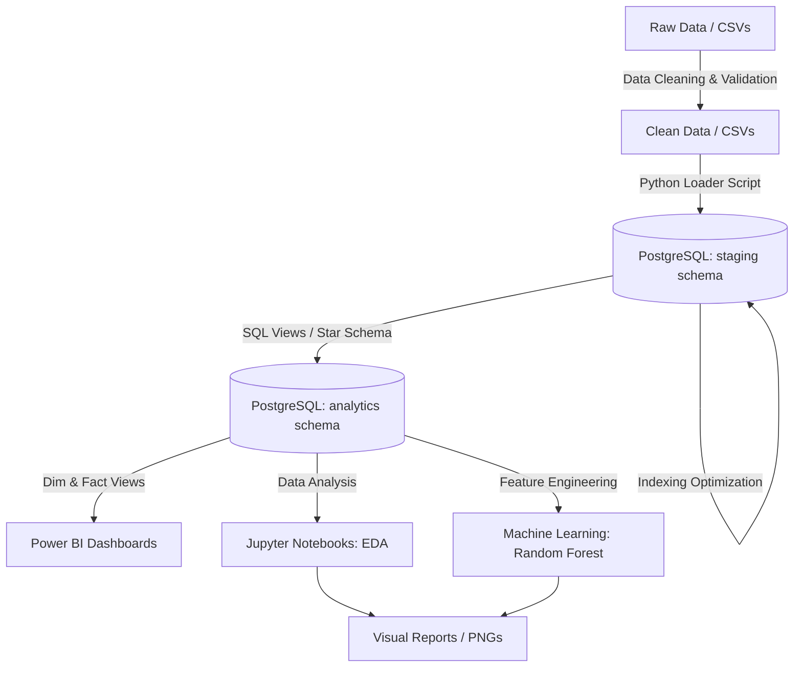

# 🛒 Olist Brazilian E-Commerce Analytics & Machine Learning Pipeline

Dự án phân tích dữ liệu toàn diện (End-to-End Analytics & Data Warehousing) trên bộ dữ liệu thương mại điện tử **Olist (Brazil)** gồm hơn 100.000 đơn hàng từ năm 2016 đến 2018. Dự án bao gồm toàn bộ quy trình từ khám phá dữ liệu thô, xây dựng pipeline làm sạch (ETL/ELT), thiết kế Data Warehouse theo mô hình Star Schema trên PostgreSQL, phân tích chuyên sâu (EDA), xây dựng mô hình Machine Learning dự đoán giao hàng trễ, đến trực quan hóa báo cáo trên Power BI.

---

## 📑 Mục lục
1. [Tổng quan dự án](#-tổng-quan-dự-án)
2. [Kiến trúc luồng xử lý (Architecture)](#-kiến-trúc-luồng-xử-lý-architecture)
3. [Cấu trúc thư mục (Project Structure)](#-cấu-trúc-thư-mục-project-structure)
4. [Mô hình dữ liệu (Data Modeling & Database Design)](#-mô-hình-dữ-liệu-data-modeling--database-design)
5. [Chi tiết các giai đoạn thực hiện (Pipeline Details)](#-chi-tiết-các-giai-đoạn-thực-hiện-pipeline-details)
   - [Giai đoạn 1: Khám phá & Làm sạch dữ liệu](#1-khám-phá--làm-sạch-dữ-liệu-eda--data-cleaning)
   - [Giai đoạn 2: Cơ sở dữ liệu & Tối ưu hóa truy vấn](#2-cơ-sở-dữ-liệu--tối-ưu-hóa-truy-vấn-postgresql)
   - [Giai đoạn 3: Phân tích chuyên sâu (EDA & Business Insights)](#3-phân-tích-chuyên-sâu-eda--business-insights)
   - [Giai đoạn 4: Xây dựng mô hình Machine Learning](#4-xây-dựng-mô-hình-machine-learning)
   - [Giai đoạn 5: Trực quan hóa & Báo cáo BI](#5-trực-quan-hóa--báo-cáo-bi-power-bi)
6. [Công nghệ & Thư viện sử dụng (Tech Stack)](#-công-nghệ--thư-viện-sử-dụng-tech-stack)
7. [Hướng dẫn cài đặt & Chạy dự án (Getting Started)](#-hướng-dẫn-cài-đặt--chạy-dự-án-getting-started)

---

## 🎯 Tổng quan dự án

- **Bộ dữ liệu**: Brazilian E-Commerce Public Dataset by Olist (9 bảng dữ liệu quan hệ: Đơn hàng, Khách hàng, Người bán, Sản phẩm, Đánh giá, Thanh toán, Danh mục, Tọa độ địa lý).
- **Mục tiêu**:
  - Xây dựng quy trình xử lý dữ liệu chuẩn hóa, tự động hóa việc làm sạch và nạp vào CSDL PostgreSQL.
  - Thiết kế kiến trúc kho dữ liệu phân lớp (`staging` và `analytics`) phục vụ báo cáo đa chiều.
  - Khai phá các insight quan trọng về doanh thu, hành vi khách hàng, hiệu suất logistics và trải nghiệm người dùng.
  - Xây dựng mô hình phân loại dự đoán rủi ro giao hàng trễ (*Late Delivery Prediction*) nhằm tối ưu chuỗi cung ứng.

---

## 🏗 Kiến trúc luồng xử lý (Architecture)



---

## 📁 Cấu trúc thư mục (Project Structure)

```text
olist-ecommerce-analytics/
│
├── data/                       # Thư mục chứa dữ liệu
│   ├── raw/                    # Dữ liệu gốc 9 bảng CSV từ Olist
│   └── clean/                  # Dữ liệu sau khi làm sạch & chuẩn hóa
│
├── database/                   # Scripts kết nối và nạp dữ liệu vào Database
│   ├── connect_db.py           # Module tạo engine kết nối PostgreSQL qua SQLAlchemy
│   └── load_to_postgres.py     # Script ETL nạp tự động dữ liệu clean vào schema 'staging'
│
├── sql/                        # Các tệp kịch bản SQL định nghĩa CSDL
│   ├── create_db.sql           # DDL tạo schema staging, 9 bảng quan hệ & Foreign Keys
│   ├── create_indx.sql         # Tạo chỉ mục B-Tree tối ưu hóa hiệu năng truy vấn
│   └── create_view.sql         # Tạo mô hình Star Schema (Dim, Fact) & Master View trong schema analytics
│
├── notebook/                   # Jupyter Notebooks nghiên cứu, phân tích & mô hình hóa
│   ├── undertand_data.ipynb    # Khám phá cấu trúc, schema và đặc tính dữ liệu thô
│   ├── cleaning_data.ipynb     # Pipeline tiền xử lý, điền khuyết thiếu, chuẩn hóa mã bang, tọa độ
│   ├── eda_123.ipynb           # EDA Phần 1: Doanh thu, Xu hướng thời gian, Phân tích Pareto, Outliers
│   ├── eda_456.ipynb           # EDA Phần 2: Logistics/Vận chuyển, Điểm đánh giá Review & Trải nghiệm
│   └── ml.ipynb                # Huấn luyện mô hình Random Forest dự đoán đơn hàng giao trễ
│
├── power_bi/                   # Tài nguyên phục vụ Business Intelligence
│   └── dax.md                  # Tài liệu định nghĩa các công thức DAX Measures cho Power BI
│
├── report/                     # Hình ảnh biểu đồ trích xuất từ EDA & Machine Learning
│   ├── monthly_revenue_trend.png
│   ├── pareto_analysis.png
│   ├── Late Delivery Percentage.png
│   ├── rf_roc_curve.png
│   ├── rf_top15_feature_importance.png
│   └── ... (22 biểu đồ chất lượng cao)
│
├── src/                        # Mã nguồn tái sử dụng (helpers / utils)
├── .env                        # Cấu hình biến môi trường kết nối Database (Host, Port, User, Password)
├── .gitignore                  # Cấu hình bỏ qua tệp nhị phân / dữ liệu lớn / cấu hình nhạy cảm
├── requirements.txt            # Danh sách các thư viện Python phụ thuộc
└── README.md                   # Tài liệu hướng dẫn & giải thích dự án
```

---

## 🗄 Mô hình dữ liệu (Data Modeling & Database Design)

Hệ thống cơ sở dữ liệu được chia làm 2 tầng (Schemas):

### 1. Schema `staging` (Tầng dữ liệu nền tảng đã làm sạch)
Chứa 9 bảng quan hệ toàn vẹn có đầy đủ Primary Key và Foreign Key:
- `customers`: Thông tin khách hàng (`customer_id`, `customer_unique_id`, zip code, thành phố, bang).
- `sellers`: Thông tin người bán đối tác.
- `products`: Thông tin sản phẩm (kích thước, trọng lượng, số ảnh, danh mục).
- `category_translation`: Bảng tra cứu dịch tên danh mục từ tiếng Bồ Đào Nha sang tiếng Anh.
- `orders`: Thông tin đơn hàng và các mốc thời gian (đặt hàng, duyệt, xuất kho, giao thực tế, ước tính).
- `order_items`: Chi tiết từng sản phẩm trong đơn, giá tiền và phí vận chuyển.
- `payments`: Phương thức thanh toán, số kỳ trả góp và giá trị thanh toán.
- `reviews`: Điểm đánh giá (1-5 sao), tiêu đề, nội dung nhận xét và thời gian phản hồi.
- `geolocation`: Dữ liệu tọa độ vĩ độ/kinh độ chuẩn hóa theo mã Zip Code.

### 2. Schema `analytics` (Mô hình Star Schema & Views)
Phục vụ phân tích đa chiều và kết nối trực tiếp vào Power BI:
- **Dimension Views**:
  - `dim_customers`: Chiều khách hàng.
  - `dim_sellers`: Chiều người bán.
  - `dim_products`: Chiều sản phẩm kèm tên tiếng Anh và thể tích khối (`product_volume_cm3`).
  - `dim_geolocation`: Tọa độ trung bình gộp theo Zip Code / Bang.
  - `dim_date`: Bảng thời gian (Time Intelligence: Ngày, Tuần, Tháng, Quý, Năm, Cuối tuần).
- **Fact Views**:
  - `fact_order_items`: Bảng Fact chi tiết đơn hàng, thời gian vận chuyển (`delivery_days`), độ trễ (`delay_days`, `is_delayed`).
  - `fact_payments`: Bảng Fact thanh toán giao dịch.
  - `fact_reviews`: Bảng Fact phản hồi đánh giá và tốc độ phản hồi.
- **Master View (`vw_sales_master`)**: Bảng One Big Table (OBT) đã denormalize đầy đủ thông tin, giúp kéo thả nhanh trên Power BI.

---

## 🔬 Chi tiết các giai đoạn thực hiện (Pipeline Details)

### 1. Khám phá & Làm sạch dữ liệu (EDA & Data Cleaning)
- **Xử lý giá trị thiếu (Missing Values)**: Điền nội dung cho review không lời thoại, ánh xạ các danh mục chưa được dịch.
- **Chuẩn hóa thời gian**: Ép kiểu các trường timestamp sang chuẩn `datetime64[ns]`.
- **Chuẩn hóa địa lý**: Ánh xạ mã 27 bang của Brazil sang tên đầy đủ, lọc bỏ các tọa độ GPS dị biệt nằm ngoài biên giới Brazil.
- **Toàn vẹn tham chiếu**: Đảm bảo tất cả Foreign Keys giữa 9 bảng khớp nối 100% trước khi nạp vào database.

### 2. Cơ sở dữ liệu & Tối ưu hóa truy vấn (PostgreSQL)
- Sử dụng SQLAlchemy và `psycopg2` để nạp dữ liệu theo lô (`chunksize=10000`, `method='multi'`).
- Tạo chỉ mục B-Tree (`create_indx.sql`) trên các cột thường xuyên `JOIN`, `WHERE`, `GROUP BY` (như `order_id`, `customer_id`, `purchase_timestamp`, `review_score`...), giúp tăng tốc độ truy vấn gấp nhiều lần.

### 3. Phân tích chuyên sâu (EDA & Business Insights)
- **Doanh thu & Đơn hàng**:
  - Xu hướng doanh thu theo tháng (tăng trưởng mạnh giai đoạn 2017 - 2018).
  - Phân tích quy luật Pareto 80/20: ~20% danh mục sản phẩm chủ lực mang lại 80% tổng doanh thu.
  - Phân bố doanh thu và đơn hàng theo từng bang (Sao Paulo, Rio de Janeiro, Minas Gerais chiếm tỷ trọng lớn nhất).
- **Vận hành Logistics & Đánh giá**:
  - Tỷ lệ giao hàng trễ (`is_delayed`) và các yếu tố ảnh hưởng từ khoảng cách địa lý.
  - Mối tương quan nghịch giữa thời gian giao hàng trễ và điểm số `review_score` (giao trễ dẫn đến đánh giá 1 sao áp đảo).

### 4. Xây dựng mô hình Machine Learning
- **Bài toán**: Phân loại nhị phân dự đoán đơn hàng có bị trễ hẹn so với ngày ước tính hay không (`is_delayed`).
- **Mô hình**: Random Forest Classifier.
- **Kỹ thuật áp dụng**:
  - Xử lý mất cân bằng dữ liệu (Class Imbalance) bằng kỹ thuật lấy mẫu / gán trọng số lớp.
  - Đánh giá mô hình bằng ROC-AUC Curve, Confusion Matrix, Precision-Recall và F1-Score.
  - Trích xuất mức độ quan trọng của đặc trưng (**Feature Importance**): Khoảng cách địa lý, kích thước/trọng lượng hàng hóa, phí vận chuyển và thời gian duyệt đơn đóng vai trò quyết định.

### 5. Trực quan hóa & Báo cáo BI (Power BI)
- Kết nối trực tiếp với các View trong schema `analytics` trên PostgreSQL.
- Định nghĩa hệ thống công thức DAX Measures cho các chỉ số KPI: Doanh thu (Revenue), Tỷ lệ tăng trưởng MoM/YoY, AOV (Average Order Value), On-time Delivery Rate, CSAT Score.

---

## 🛠 Công nghệ & Thư viện sử dụng (Tech Stack)

| Lĩnh vực | Công nghệ / Thư viện |
| :--- | :--- |
| **Ngôn ngữ lập trình** | Python 3.10+ |
| **Hệ quản trị CSDL** | PostgreSQL (Schema Staging & Analytics) |
| **Xử lý & Phân tích dữ liệu** | `pandas`, `numpy` |
| **Tương tác Cơ sở dữ liệu** | `SQLAlchemy`, `psycopg2-binary`, `python-dotenv` |
| **Học máy (Machine Learning)** | `scikit-learn`, `imbalanced-learn` |
| **Trực quan hóa dữ liệu** | `matplotlib`, `seaborn`, `squarify` |
| **Business Intelligence** | Microsoft Power BI, DAX |
| **Môi trường phát triển** | Jupyter Notebook, VS Code |

---

## 🚀 Hướng dẫn cài đặt & Chạy dự án (Getting Started)

### 1. Clone dự án và cài đặt môi trường
```bash
# Clone repository
git clone https://github.com/doanquangminh14/olist-project.git
cd olist-ecommerce-analytics

# Tạo môi trường ảo (khuyến nghị)
python -m venv .venv
source .venv/bin/activate  # Trên Linux/macOS
# hoặc: .venv\Scripts\activate  # Trên Windows

# Cài đặt các thư viện cần thiết
pip install -r requirements.txt
```

### 2. Cấu hình biến môi trường Database
Tạo tệp `.env` tại thư mục gốc với thông tin kết nối PostgreSQL .


### 3. Tạo Schema & Bảng trong PostgreSQL
Thực thi lần lượt các tệp SQL trong thư mục `sql/`:
```bash
# 1. Tạo Database & Schema staging
psql -U postgres -d olist_ecommerce -f sql/create_db.sql

# 2. Tạo Indexes tăng tốc truy vấn
psql -U postgres -d olist_ecommerce -f sql/create_indx.sql

# 3. Tạo Star Schema & Views phân tích
psql -U postgres -d olist_ecommerce -f sql/create_view.sql
```

### 4. Nạp dữ liệu vào PostgreSQL
Chạy script ETL Python để đẩy dữ liệu sạch từ `data/clean/` vào CSDL:
```bash
python database/load_to_postgres.py
```

### 5. Khám phá Notebooks & Chạy mô hình
Khởi động Jupyter Lab / Notebook để chạy các kịch bản phân tích và Machine Learning:
```bash
jupyter notebook
```
- Mở `notebook/cleaning_data.ipynb` để xem quy trình xử lý dữ liệu.
- Mở `notebook/eda_123.ipynb` và `notebook/eda_456.ipynb` để xem phân tích số liệu và đồ thị.
- Mở `notebook/ml.ipynb` để xem quá trình huấn luyện và đánh giá mô hình Random Forest.

---

## 📊 Hình ảnh kết quả phân tích tiêu biểu

Các biểu đồ phân tích chi tiết được lưu trữ trong thư mục [`report/`](report/):

| Xu hướng doanh thu hàng tháng | Phân tích quy luật Pareto 80/20 |
| :---: | :---: |
|  |  |

| Tỷ lệ giao hàng trễ theo bang | Feature Importance (Machine Learning) |
| :---: | :---: |
|  |  |

---

## 👤 Tác giả & Đóng góp
- **Author**: Minh Doan ([doanquangminh14](https://github.com/doanquangminh14))
- Mọi đóng góp, báo lỗi hoặc đề xuất cải tiến vui lòng mở **Issue** hoặc tạo **Pull Request**.