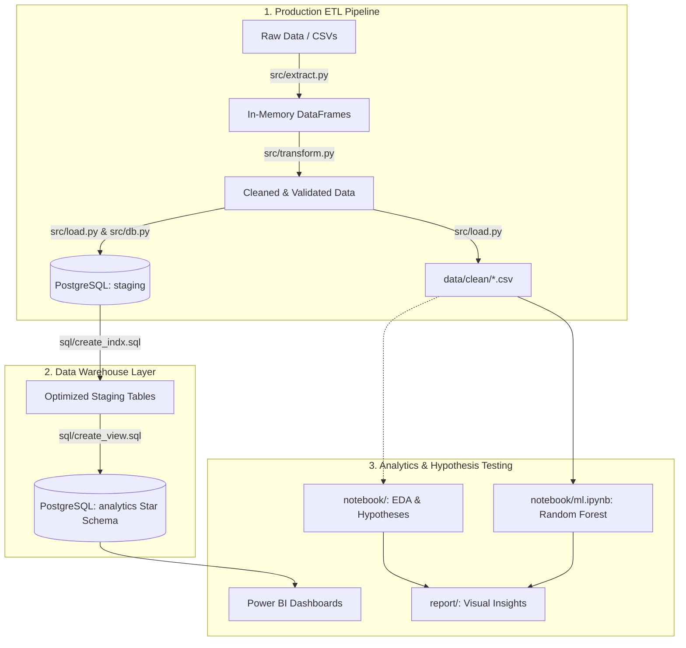
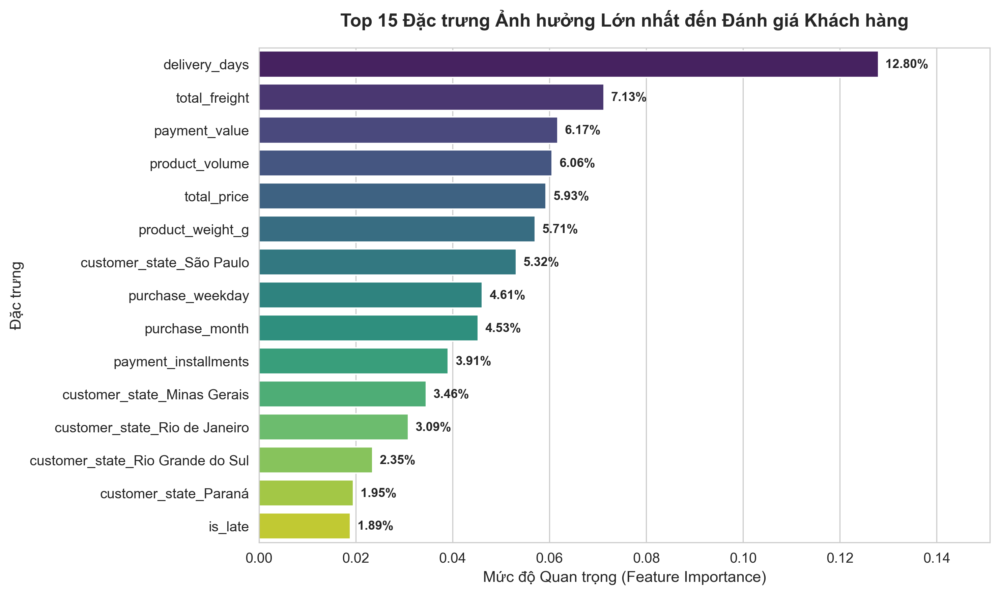

# 🛒 Olist Brazilian E-Commerce Analytics & Machine Learning Pipeline

Dự án phân tích dữ liệu toàn diện (End-to-End Analytics & Data Warehousing) trên bộ dữ liệu thương mại điện tử **Olist (Brazil)** gồm hơn 100.000 đơn hàng từ năm 2016 đến 2018. 

Dự án được phân tách rõ ràng theo chuẩn công nghiệp:
- **`src/`**: Pipeline ETL (Extract - Transform - Load) dạng module hóa trong Python, tự động hóa toàn bộ quá trình làm sạch dữ liệu, kiểm tra ràng buộc toàn vẹn và nạp vào PostgreSQL.
- **`notebook/`**: Dành riêng cho nghiên cứu thăm dò (Exploratory Data Analysis - EDA), kiểm chứng các giả thuyết kinh doanh và thử nghiệm mô hình Machine Learning.
- **`sql/`**: Data Warehouse kiến trúc Star Schema (Dimension, Fact, Master Views) tối ưu chỉ mục B-Tree trên PostgreSQL.
- **`power_bi/` & `report/`**: Trực quan hóa báo cáo phân tích và theo dõi các chỉ số KPI.

---

## 📑 Mục lục
1. [Tổng quan dự án](#-tổng-quan-dự-án)
2. [Kiến trúc luồng xử lý (Architecture)](#-kiến-trúc-luồng-xử-lý-architecture)
3. [Cấu trúc thư mục (Project Structure)](#-cấu-trúc-thư-mục-project-structure)
4. [Mô hình dữ liệu (Data Modeling & Database Design)](#-mô-hình-dữ-liệu-data-modeling--database-design)
5. [Pipeline ETL trong `src/`](#-pipeline-etl-trong-src)
6. [Khu vực Nghiên cứu & Giả thuyết trong `notebook/`](#-khu-vực-nghiên-cứu--giả-thuyết-trong-notebook)
7. [Công nghệ & Thư viện sử dụng (Tech Stack)](#-công-nghệ--thư-viện-sử-dụng-tech-stack)
8. [Hướng dẫn cài đặt & Chạy dự án (Getting Started)](#-hướng-dẫn-cài-đặt--chạy-dự-án-getting-started)

---

## 🎯 Tổng quan dự án

- **Bộ dữ liệu**: Brazilian E-Commerce Public Dataset by Olist (9 bảng dữ liệu quan hệ: Đơn hàng, Khách hàng, Người bán, Sản phẩm, Đánh giá, Thanh toán, Danh mục, Tọa độ địa lý).
- **Mục tiêu**:
  - Tự động hóa pipeline ETL làm sạch và nạp 9 tập dữ liệu sạch vào CSDL PostgreSQL một cách nhất quán.
  - Xây dựng kho dữ liệu phân lớp (`staging` và `analytics`) phục vụ báo cáo đa chiều.
  - Phân tích khám phá và kiểm chứng các giả thuyết về doanh thu, logistics và độ hài lòng của khách hàng.
  - Dự đoán đơn hàng có nguy cơ giao trễ bằng thuật toán Random Forest.

---

## 🏗 Kiến trúc luồng xử lý (Architecture)



---

## 📁 Cấu trúc thư mục (Project Structure)

```text
olist-ecommerce-analytics/
│
├── main.py                     # Điểm chạy chính (Entrypoint) cho toàn bộ Pipeline ETL
├── requirements.txt            # Danh sách các thư viện Python phụ thuộc
├── .env                        # Cấu hình biến môi trường kết nối Database (Host, Port, User, Password)
├── README.md                   # Tài liệu chi tiết về dự án
│
├── data/                       # Thư mục dữ liệu
│   ├── raw/                    # 9 tệp dữ liệu thô gốc từ Olist
│   └── clean/                  # 9 tệp dữ liệu sau khi được pipeline xử lý sạch
│
├── src/                        # ⚡ CORE ETL ENGINE (Production Pipeline)
│   ├── __init__.py             # Khởi tạo package và cấu hình UTF-8 console
│   ├── config.py               # Thiết lập đường dẫn, ánh xạ 27 bang, cấu hình DB
│   ├── extract.py              # Đọc dữ liệu thô từ data/raw/
│   ├── transform.py            # Tiền xử lý, chuẩn hóa, lọc dị biệt & kiểm tra toàn vẹn (FK)
│   ├── load.py                 # Lưu trữ data/clean/ & nạp vào PostgreSQL schema staging
│   ├── db.py                   # Quản lý kết nối DB, kiểm thử & thực thi DDL/Views SQL
│   └── pipeline.py             # Điều phối (Orchestrator) toàn bộ luồng ETL kèm CLI flags
│
├── database/                   # Scripts hỗ trợ thao tác CSDL phụ trợ
│   ├── connect_db.py           # Module kết nối cơ sở dữ liệu
│   └── load_to_postgres.py     # Script nạp dữ liệu độc lập
│
├── sql/                        # Kịch bản SQL định nghĩa Data Warehouse
│   ├── create_db.sql           # DDL tạo schema staging, 9 bảng quan hệ & Foreign Keys
│   ├── create_indx.sql         # Tạo chỉ mục B-Tree tối ưu hóa hiệu năng truy vấn
│   └── create_view.sql         # Tạo mô hình Star Schema (Dim, Fact) & Master View
│
├── notebook/                   # 🔬 NGHIÊN CỨU & KIỂM CHỨNG GIẢ THUYẾT (Jupyter)
│   ├── undertand_data.ipynb    # Khám phá cấu trúc, phân bố và các vấn đề của dữ liệu thô
│   ├── cleaning_data.ipynb     # Notebook thử nghiệm các bước tiền xử lý trước khi đóng gói vào src/
│   ├── eda_123.ipynb           # Kiểm chứng giả thuyết về Doanh thu, Xu hướng thời gian, Pareto 80/20
│   ├── eda_456.ipynb           # Kiểm chứng giả thuyết về Vận chuyển/Logistics & Điểm đánh giá Review
│   └── ml.ipynb                # Thử nghiệm mô hình Machine Learning dự đoán giao hàng trễ
│
├── power_bi/                   # Tài nguyên Power BI
│   └── dax.md                  # Tài liệu định nghĩa các công thức DAX Measures
│
└── report/                     # Hình ảnh biểu đồ trích xuất từ EDA & Machine Learning (22 biểu đồ)
```

---

## ⚡ Pipeline ETL trong `src/`

Pipeline được thiết kế theo nguyên lý mô-đun hóa cao (High Cohesion, Loose Coupling):

1. **`extract.py`**:
   - Quét và nạp toàn bộ 9 tệp dữ liệu thô từ `data/raw/` vào bộ nhớ.
2. **`transform.py`**:
   - Chuẩn hóa kiểu ngày giờ `datetime64[ns]` trên toàn bộ các cột thời gian.
   - Xử lý các giá trị khuyết thiếu (`reviews`, `products`).
   - Xử lý bất thường thanh toán (loại bỏ `payment_type = 'not_defined'`, chuẩn hóa kỳ trả góp).
   - Đồng bộ danh mục dịch thuật tiếng Anh (`category_translation`).
   - Chuyển đổi mã 27 bang viết tắt sang tên đầy đủ (`SP` $\to$ `São Paulo`).
   - Khử trùng lặp và loại bỏ tọa độ ngoại lai ngoài lãnh thổ Brazil (`geolocation`).
   - **Tự động kiểm tra ràng buộc toàn vẹn tham chiếu (Foreign Key Integrity)**: Đảm bảo 100% không có bản ghi mồ côi (*orphan records*) giữa các bảng liên kết.
3. **`load.py`**:
   - Xuất dữ liệu sạch ra thư mục `data/clean/*.csv`.
   - Nạp tuần tự 9 bảng vào schema `staging` của PostgreSQL theo đúng thứ tự phụ thuộc khóa ngoại.
4. **`db.py`**:
   - Cung cấp engine SQLAlchemy, kiểm tra kết nối và thực thi các tệp DDL/Views SQL.
5. **`pipeline.py` / `main.py`**:
   - Điểm kích hoạt toàn bộ luồng với các tùy chọn dòng lệnh linh hoạt.

---

## 🔬 Khu vực Nghiên cứu & Giả thuyết trong `notebook/`

Các tệp Jupyter Notebook đóng vai trò là không gian thử nghiệm, tìm hiểu và kiểm chứng các giả thuyết kinh doanh:

- **Giả thuyết Doanh thu & Danh mục ([`eda_123.ipynb`](notebook/eda_123.ipynb))**:
  - *Giả thuyết*: Doanh số Olist tăng trưởng theo chu kỳ mùa vụ và tuân theo nguyên lý Pareto 80/20.
  - *Kết quả*: Doanh thu đạt đỉnh vào tháng 11 (Black Friday) và quý 1-2 năm 2018; khoảng 20% danh mục đem lại phần lớn doanh thu.
- **Giả thuyết Logistics & Trải nghiệm ([`eda_456.ipynb`](notebook/eda_456.ipynb))**:
  - *Giả thuyết*: Thời gian giao hàng chậm trễ so với ngày dự kiến là nguyên nhân chính dẫn đến đánh giá 1 sao.
  - *Kết quả*: Tỷ lệ đánh giá tiêu cực (1-2 sao) tăng vọt khi đơn hàng giao trễ (`is_delayed = 1`).
- **Mô hình Dự đoán ([`ml.ipynb`](notebook/ml.ipynb))**:
  - Xây dựng mô hình Random Forest Classifier để phát hiện sớm các đơn hàng có nguy cơ bị giao trễ nhằm kích hoạt cảnh báo chuỗi cung ứng.

---

## 🗄 Mô hình dữ liệu (Data Modeling & Database Design)

- **Schema `staging`**: Lưu trữ 9 bảng sạch nguyên bản với đầy đủ Primary Key, Foreign Key và chỉ mục B-Tree:
  - `customers`, `sellers`, `products`, `category_translation`, `orders`, `order_items`, `payments`, `reviews`, `geolocation`.
- **Schema `analytics` (Star Schema)**:
  - **Dimension Views**: `dim_customers`, `dim_sellers`, `dim_products`, `dim_geolocation`, `dim_date`.
  - **Fact Views**: `fact_order_items`, `fact_payments`, `fact_reviews`.
  - **Master View (`vw_sales_master`)**: Dạng One Big Table (OBT) tối ưu hóa truy vấn nhanh cho Power BI.

---

## 🛠 Công nghệ & Thư viện sử dụng (Tech Stack)

| Hạng mục | Công nghệ / Thư viện |
| :--- | :--- |
| **Ngôn ngữ** | Python 3.10+ |
| **Cơ sở dữ liệu** | PostgreSQL (Schema `staging` & `analytics`) |
| **Xử lý dữ liệu** | `pandas`, `numpy`, `SQLAlchemy`, `psycopg2-binary` |
| **Mô hình hóa (ML)** | `scikit-learn`, `imbalanced-learn` |
| **Trực quan hóa** | `matplotlib`, `seaborn`, `squarify`, Microsoft Power BI |

---

## 🚀 Hướng dẫn cài đặt & Chạy dự án (Getting Started)

### 1. Cài đặt môi trường
```bash
# Clone repository
git clone https://github.com/doanquangminh14/olist-project.git
cd olist-ecommerce-analytics

# Tạo môi trường ảo
python -m venv .venv
source .venv/bin/activate  # Trên Linux/macOS
# hoặc: .venv\Scripts\activate  # Trên Windows

# Cài đặt thư viện phụ thuộc
pip install -r requirements.txt
```

### 2. Cấu hình biến môi trường
Tạo tệp `.env` tại thư mục gốc từ mẫu `.env.example` và điền thông tin kết nối PostgreSQL của bạn:
```env
DB_HOST=your_host
DB_PORT=your_port
DB_NAME=your_database_name
DB_USER=your_username
DB_PASSWORD=your_password
```

### 3. Chạy Pipeline ETL tự động (`src/`)

Bạn có thể chạy toàn bộ pipeline ETL một cách linh hoạt:

```bash
# Cách 1: Chạy toàn bộ luồng (Extract -> Transform -> Export CSV -> Nạp vào PostgreSQL)
python main.py

# Cách 2: Chạy đầy đủ kèm khởi tạo Database (Tạo Schemas, Bảng, Index, Star Schema Views)
python main.py --run-sql-setup

# Cách 3: Chỉ làm sạch và xuất CSV ra data/clean/ (không cần kết nối CSDL)
python main.py --clean-only

# Cách 4: Kiểm tra và đối soát số lượng dòng trong CSDL so với dữ liệu sạch (Data Verification)
python main.py --verify-db
```

### 4. Mở Notebooks để nghiên cứu & thử nghiệm giả thuyết
```bash
jupyter notebook
```
- Mở các notebook trong thư mục `notebook/` để tham khảo quá trình phân tích dữ liệu và xây dựng mô hình.

---

## 📊 Một số biểu đồ phân tích tiêu biểu

Các biểu đồ phân tích chi tiết nằm trong thư mục [`report/`](report/):

| Xu hướng doanh thu hàng tháng | Phân tích Pareto 80/20 |
| :---: | :---: |
|  |  |

| Tỷ lệ giao hàng trễ | Mức độ quan trọng đặc trưng (ML) |
| :---: | :---: |
|  |  |

---

## 👤 Tác giả
- **Author**: Minh Doan ([doanquangminh14](https://github.com/doanquangminh14))