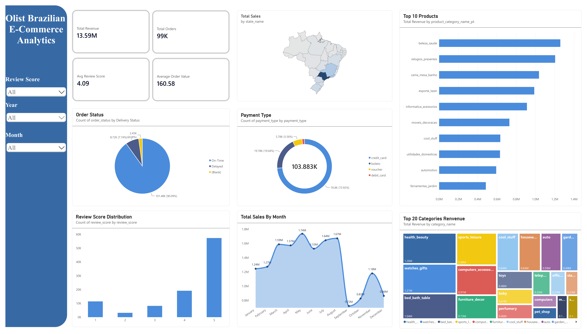

# Olist Brazilian E-Commerce Analytics - Power BI Dashboard

Báo cáo trực quan hóa tương tác đa chiều (Interactive Business Intelligence Dashboard) được xây dựng trên **Power BI Desktop**, kết nối trực tiếp với mô hình dữ liệu Data Warehouse / Clean Data của sàn thương mại điện tử **Olist (Brazil)**.

---

## 1. Tổng Quan Dashboard

Dashboard cung cấp cái nhìn toàn diện 360 độ về hiệu quả kinh doanh, chuỗi cung ứng logistics, hành vi thanh toán và mức độ hài lòng của khách hàng trên toàn lãnh thổ Brazil.

---

## 2. Danh Sách Tệp Trong Thư Mục

| Tên Tệp | Định Dạng | Mô Tả |
| :--- | :--- | :--- |
| **`olist_ecommerce.pbix`** | Power BI File | Tệp nguồn thiết kế dashboard trên Power BI Desktop với đầy đủ Data Model, DAX Measures và tương tác lọc đa chiều. |
| **`olist_ecommerce.pdf`** | PDF Document | Bản xuất tĩnh chất lượng cao của Dashboard báo cáo. |
| **`dashboard_overview.png`** | Image (PNG) | Hình ảnh trực quan tổng thể Dashboard phục vụ xem nhanh và nhúng tài liệu. |
| **`README.md`** | Markdown | Tài liệu diễn giải các chỉ số KPIs, biểu đồ và insight nghiệp vụ. |

---

## 3. Các Chỉ Số Điều Hành Cốt Lõi (Executive KPIs)

- **Total Revenue (Tổng Doanh Thu)**: **`13.59M BRL`** — Tổng giá trị hàng hóa và vận chuyển được tạo ra trong toàn bộ chu kỳ dữ liệu.
- **Total Orders (Tổng Số Đơn Hàng)**: **`99K`** — Gần 100.000 đơn hàng thành công được ghi nhận.
- **Average Review Score (Điểm Đánh Giá Trung Bình)**: **`4.09 / 5.0`** — Mức độ hài lòng chung của khách hàng trên nền tảng ở mức tích cực.
- **Average Order Value - AOV (Giá Trị Trung Bình/Đơn)**: **`160.58 BRL`** — Giá trị chi tiêu trung bình của một đơn hàng.
- **Total Payment Transactions (Tổng Giao Dịch Thanh Toán)**: **`103.883K`** — Số lượt giao dịch qua các cổng thanh toán (một đơn hàng có thể thanh toán bằng nhiều hình thức/voucher).

---

## 4. Chi Tiết Các Trực Quan Hóa (Visualizations)

### 4.1. Phân Bố Doanh Thu Theo Địa Lý (Total Sales by State)
- **Dạng biểu đồ**: Geographic Shape Map (Bản đồ phân vùng 27 bang Brazil).
- **Insight**: 
  - Doanh thu và lưu lượng đơn hàng tập trung chủ yếu tại khu vực Đông Nam (Southeast) và Nam (South) của Brazil, đặc biệt là bang **São Paulo (SP)**, **Rio de Janeiro (RJ)**, và **Minas Gerais (MG)**.
  - Các bang vùng sâu/vùng xa phía Bắc và Đông Bắc có mật độ đơn hàng thấp hơn và chịu chi phí cũng như thời gian giao hàng dài hơn.

### 4.2. Top 10 Sản Phẩm Doanh Thu Cao Nhất (Top 10 Products by Revenue)
- **Dạng biểu đồ**: Horizontal Bar Chart.
- **Top Danh mục dẫn đầu**:
  1. `beleza_saude` (Health & Beauty)
  2. `relogios_presentes` (Watches & Gifts)
  3. `cama_mesa_banho` (Bed, Bath & Table)
  4. `esporte_lazer` (Sports & Leisure)
  5. `informatica_acessorios` (Computers Accessories)
  6. `moveis_decoracao` (Furniture & Decoration)
  7. `cool_stuff`
  8. `utilidades_domesticas` (Housewares)
  9. `automotivo` (Auto)
  10. `ferramentas_jardim` (Garden Tools)

### 4.3. Hiệu Quả Giao Hàng & Trạng Thái Đơn (Order Status by Delivery Performance)
- **Dạng biểu đồ**: Donut Chart.
- **Tỷ trọng**:
  - **On-Time (Đúng/Trước hạn)**: **`101.48K`** đơn (**`90.09%`**) — Thể hiện năng lực vận hành cốt lõi đáp ứng cam kết.
  - **Delayed (Giao trễ hạn)**: **`8.72K`** đơn (**`7.74%`**) — Nhóm rủi ro cao gây sụt giảm mạnh điểm đánh giá review.
  - **Khác/Chưa xác định**: **`2.45K`** đơn (**`2.18%`**).

### 4.4. Cơ Cấu Phương Thức Thanh Toán (Payment Type Distribution)
- **Dạng biểu đồ**: Donut Chart.
- **Tỷ trọng**:
  - **Credit Card (Thẻ tín dụng)**: **`76.8K`** giao dịch (**`73.92%`**) — Kênh thanh toán phổ biến nhất nhờ hỗ trợ trả góp (installments).
  - **Boleto**: **`19.78K`** giao dịch (**`19.04%`**) — Phương thức thanh toán phiếu thu truyền thống đặc trưng tại Brazil.
  - **Voucher**: **`5.78K`** giao dịch (**`5.56%`**).
  - **Debit Card (Thẻ ghi nợ)**: Chiếm tỷ lệ nhỏ còn lại.

### 4.5. Phân Bố Điểm Đánh Giá Của Khách Hàng (Review Score Distribution)
- **Dạng biểu đồ**: Column Chart (Phân bố từ 1 đến 5 sao).
- **Insight**: 
  - Điểm 5 sao chiếm số lượng áp đảo (>57.000 đánh giá), thể hiện phần lớn trải nghiệm mua sắm là hài lòng.
  - Điểm 1 sao (>11.000 đánh giá) là nhóm phản hồi tiêu cực lớn thứ hai, có mối tương quan thuận mạnh mẽ với các đơn hàng bị giao trễ hoặc gặp sự cố sản phẩm.

### 4.6. Xu Hướng Doanh Thu Theo Tháng (Total Sales By Month)
- **Dạng biểu đồ**: Area / Line Chart.
- **Diễn biến chu kỳ**:
  - Doanh thu duy trì đà tăng trưởng cao trong các tháng từ tháng 3 đến tháng 8 (đạt đỉnh vào tháng 5 với **`1.74M BRL`**, tháng 8 với **`1.67M BRL`**).
  - Giai đoạn cuối năm có sự phục hồi mạnh vào tháng 11 (**`1.18M BRL`**) nhờ sự kiện mua sắm toàn cầu Black Friday.

### 4.7. Tỷ Trọng Đóng Góp 20 Ngành Hàng Hàng Đầu (Top 20 Categories Revenue)
- **Dạng biểu đồ**: Treemap Chart.
- **Insight**: Minh họa trực quan quy mô thị phần của các ngành hàng chủ lực như `health_beauty` (1.26M), `watches_gifts` (1.21M), `bed_bath_table` (1.04M), `sports_leisure` (0.99M), `computers_accessories` (0.91M),... hỗ trợ quản lý danh mục và phân bổ nguồn lực marketing.

---

## 5. Bộ Lọc Tương Tác Đa Chiều (Interactive Slicers)

Dashboard được trang bị thanh điều khiển bên trái cho phép phân tích chéo (drill-down & cross-filtering) tức thì:
1. **Review Score**: Lọc theo mức độ hài lòng (1 sao, 2 sao, 3 sao, 4 sao, 5 sao hoặc All).
2. **Year**: Lọc theo năm phát sinh giao dịch (2016, 2017, 2018).
3. **Month**: Lọc theo tháng trong năm (January đến December).
4. **Order / Delivery Status**: Tương tác trực tiếp trên biểu đồ để xem doanh thu và phản hồi tương ứng theo trạng thái vận chuyển.

---

## 6. Hướng Dẫn Mở & Tái Sử Dụng File

1. **Yêu cầu phần mềm**:
   - Cài đặt **Microsoft Power BI Desktop** (khuyến nghị phiên bản mới nhất).
2. **Cách mở tệp**:
   - Nhấp đúp vào tệp [`olist_ecommerce.pbix`](olist_ecommerce.pbix) trong thư mục này.
   - Nếu cần cập nhật dữ liệu (Refresh Data), cấu hình lại chuỗi kết nối đến PostgreSQL (sử dụng thông tin trong tệp `.env`) hoặc trỏ nguồn tới thư mục `data/clean/`.
