# 📊 Báo Cáo Phân Tích Chuyên Sâu Về Kinh Doanh (Business Insights)

Thư mục này tổng hợp các biểu đồ trực quan hóa và báo cáo phân tích chuyên sâu được trích xuất từ quá trình khám phá dữ liệu (EDA) trong [`notebook/eda_123.ipynb`](../../notebook/eda_123.ipynb) và [`notebook/eda_456.ipynb`](../../notebook/eda_456.ipynb) trên bộ dữ liệu thương mại điện tử Olist (Brazil).

---

## 📑 Mục Lục
1. [Xu Hướng Doanh Thu & Đơn Hàng](#1-xu-hướng-doanh-thu--đơn-hàng-revenue--orders-trend)
2. [Phân Phối & Phát Hiện Dị Biệt Doanh Thu](#2-phân-phối--phát-hiện-dị-biệt-doanh-thu-revenue-distribution--outliers)
3. [Phân Tích Địa Lý & Khách Hàng](#3-phân-tích-địa-lý--hành-vi-khách-hàng-customer--geographic-analysis)
4. [Phân Tích Danh Mục Sản Phẩm & Nguyên Lý Pareto 80/20](#4-phân-tích-danh-mục-sản-phẩm--nguyên-lý-pareto-8020)
5. [Vận Chuyển, Logistics & Độ Hài Lòng Khách Hàng](#5-vận-chuyển-logistics--độ-hài-lòng-khách-hàng)
6. [Ma Trận Tương Quan Đa Biến](#6-ma-trận-tương-quan-đa-biến-correlation-matrix)
7. [Đề Xuất & Khuyến Nghị Chiến Lược Kinh Doanh](#7-đề-xuất--khuyến-nghị-chiến-lược-kinh-doanh)

---

## 1. Xu Hướng Doanh Thu & Đơn Hàng (Revenue & Orders Trend)

### 📈 Tăng trưởng doanh thu và số lượng đơn theo tháng

| Xu Hướng Doanh Thu Hàng Tháng | Xu Hướng Đơn Hàng Hàng Tháng |
| :---: | :---: |
| 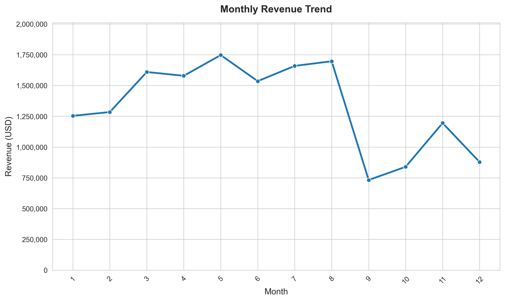 | 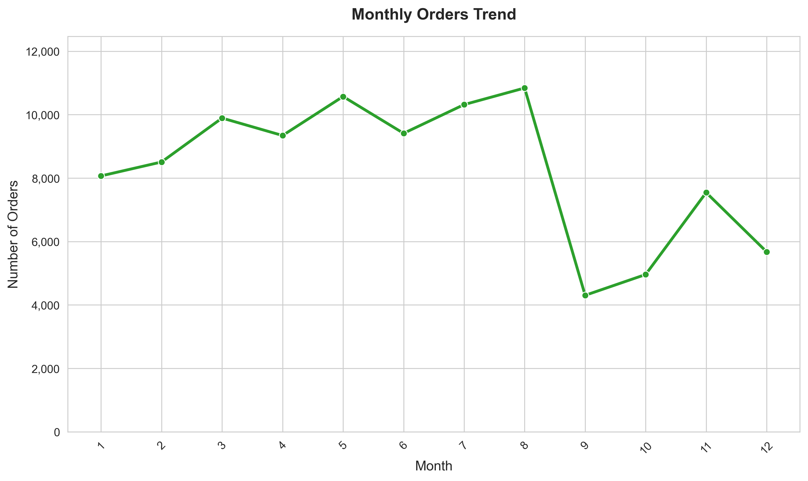 |

### 💡 Insights Chính:
- **Tăng trưởng vượt bậc**: Giai đoạn từ cuối năm 2016 đến giữa năm 2018 ghi nhận tốc độ tăng trưởng liên tục về cả GMV (Gross Merchandise Value) và số lượng đơn hàng.
- **Đỉnh cao Black Friday**: Tháng 11/2017 chứng kiến sự bùng nổ mạnh mẽ về doanh thu và lượng đặt hàng nhờ hiệu ứng Black Friday.
- **Duy trì ổn định trong năm 2018**: Đầu năm 2018 (Quý 1 & Quý 2), doanh thu duy trì ở mức cao trên 1 triệu BRL/tháng với trung bình ~6.500 - 7.000 đơn hàng mỗi tháng.

---

## 2. Phân Phối & Phát Hiện Dị Biệt Doanh Thu (Revenue Distribution & Outliers)

| Phân Phối Doanh Thu (Histogram & KDE) | Phát Hiện Dị Biệt Doanh Thu (Boxplot) |
| :---: | :---: |
| 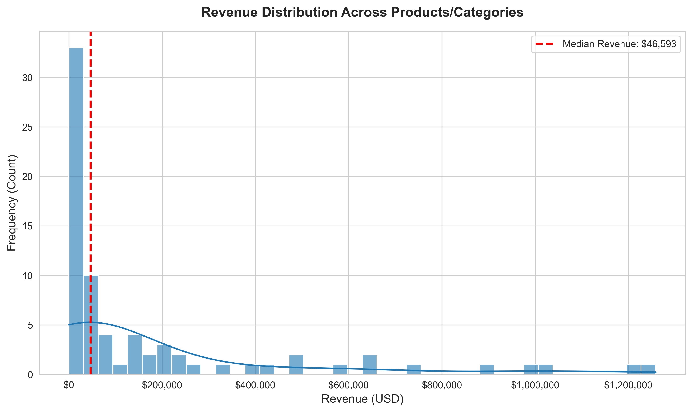 | 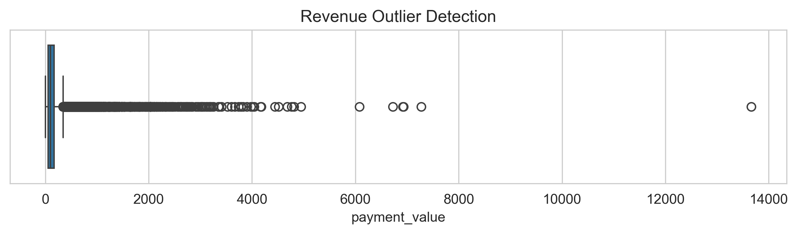 |

### 💡 Insights Chính:
- **Phân phối lệch phải mạnh (Right-skewed)**: Phần lớn các giao dịch có giá trị đơn hàng từ thấp đến trung bình (dưới 200 BRL).
- **Điểm dị biệt (Outliers)**: Xuất hiện một số ít giao dịch có giá trị rất lớn (lên tới hàng nghìn BRL), chủ yếu thuộc các danh mục thiết bị công nghệ cao, máy tính hoặc đặt hàng số lượng lớn (B2B/sỉ).

---

## 3. Phân Tích Địa Lý & Hành Vi Khách Hàng (Customer & Geographic Analysis)

### 🗺 Phân bổ khách hàng theo bang & Hành vi chi tiêu

| Phân Bố Khách Hàng Theo Bang (Top States) | Nhận Diện Dị Biệt Chi Tiêu Khách Hàng |
| :---: | :---: |
| 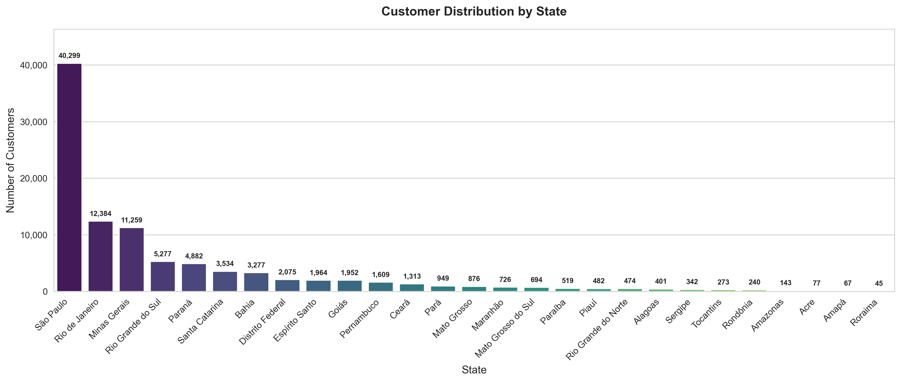 | 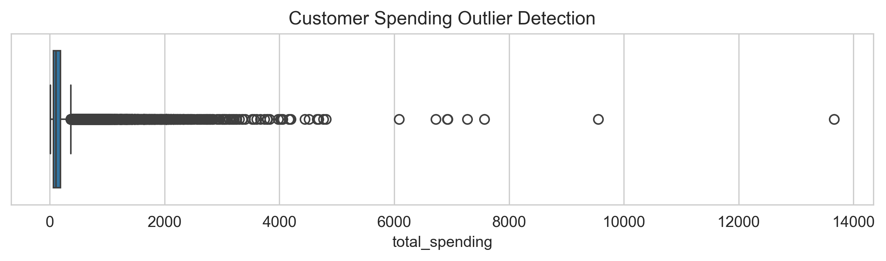 |

| Top 20 Khách Hàng Chi Tiêu Cao Nhất | Top 20 Khách Hàng Đặt Nhiều Đơn Nhất |
| :---: | :---: |
| 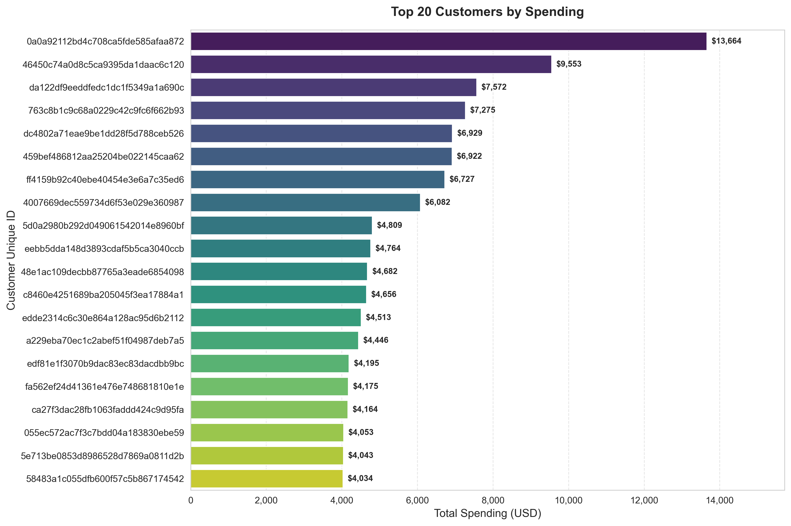 | 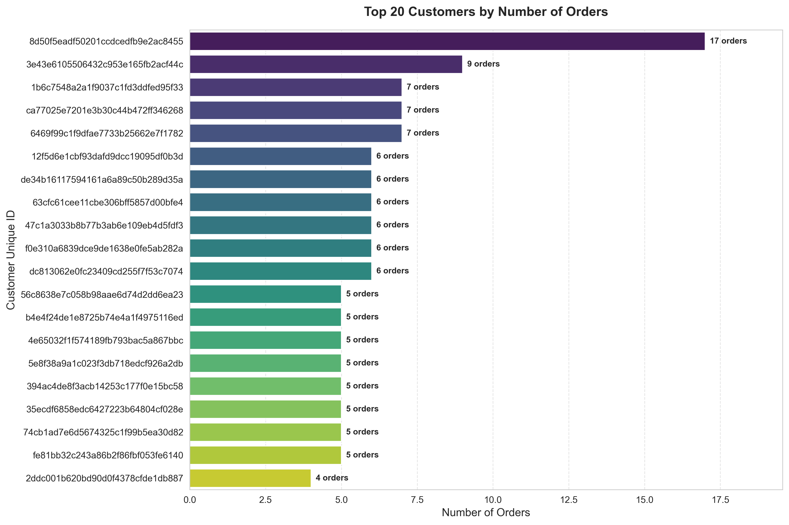 |

### 💡 Insights Chính:
- **Tập trung vùng Đông Nam (Southeast Region)**: Bang **São Paulo (SP)** chiếm hơn 40% tổng lượng khách hàng của nền tảng, tiếp theo là Rio de Janeiro (RJ), Minas Gerais (MG) và Rio Grande do Sul (RS).
- **Hành vi mua sắm**: Đa số người tiêu dùng cá nhân chỉ đặt 1 đơn hàng trên sàn (tỷ lệ mua lại thấp), cho thấy nền tảng cần cải thiện chiến lược Retention và Loyalty Program.
- **Khách hàng VIP / Chi tiêu khủng**: Một số khách hàng chi tiêu vượt trội từ 5.000 đến hơn 13.000 BRL cho các đơn hàng đặc thù.

---

## 4. Phân Tích Danh Mục Sản Phẩm & Nguyên Lý Pareto 80/20

### 🏆 Top Danh Mục Sản Phẩm & Phân Tích Tỷ Trọng

| Top 10 Danh Mục Theo Doanh Thu | Top 10 Danh Mục Theo Sản Lượng Bán |
| :---: | :---: |
| 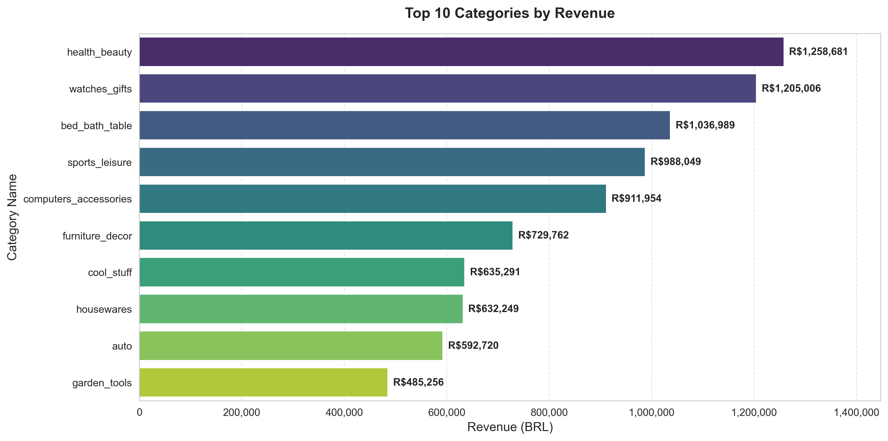 | 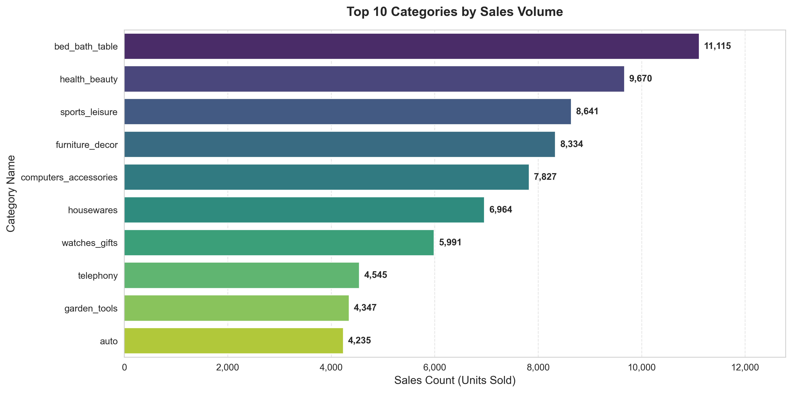 |

| Phân Tích Nguyên Lý Pareto 80/20 | Treemap Tỷ Trọng Doanh Thu Danh Mục |
| :---: | :---: |
| 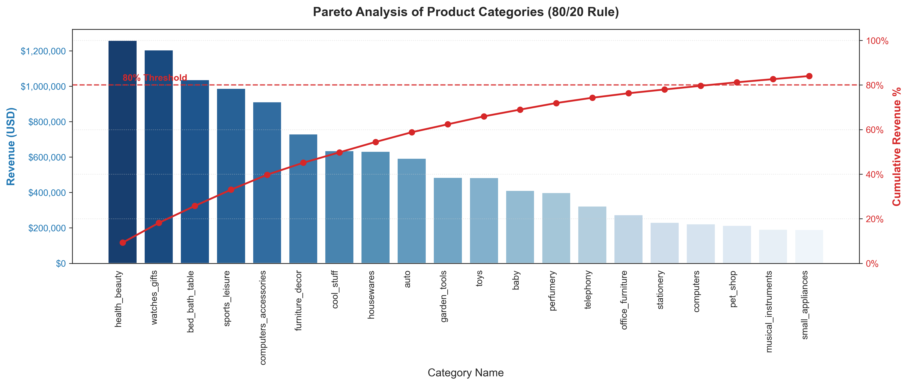 | 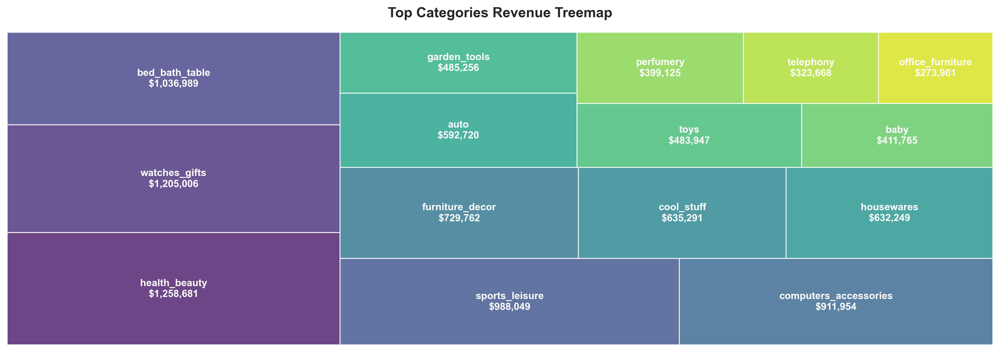 |

| Phát Hiện Dị Biệt Theo Danh Mục Sản Phẩm |
| :---: |
| 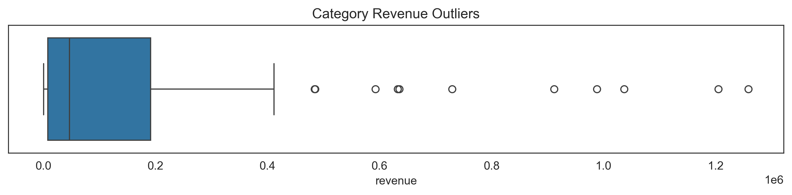 |

### 💡 Insights Chính:
- **Nguyên lý Pareto 80/20 được kiểm chứng rõ nét**: Khoảng **20% số danh mục sản phẩm hàng đầu đóng góp hơn 80% tổng doanh thu** cho toàn sàn.
- **Top Danh mục dẫn đầu GMV**:
  1. `beleza_saude` (Sức khỏe & Sắc đẹp)
  2. `relogios_presentes` (Đồng hồ & Quà tặng)
  3. `cama_mesa_banho` (Nội thất phòng ngủ - Ga trải giường)
  4. `esporte_lazer` (Thể thao & Dã ngoại)
  5. `informatica_acessorios` (Thiết bị tin học & Phụ kiện máy tính)
- **Top Danh mục theo sản lượng**: `cama_mesa_banho` và `beleza_saude` là hai ngành hàng có khối lượng tiêu thụ cao nhất.

---

## 5. Vận Chuyển, Logistics & Độ Hài Lòng Khách Hàng

### 🚚 Đánh giá dịch vụ giao vận và trải nghiệm người dùng

| Tỷ Lệ Giao Hàng Trễ (Late Delivery Rate) | Phân Nhóm Thời Gian Giao Hàng (Delivery Buckets) |
| :---: | :---: |
|  |  |

| Phân Phối Điểm Đánh Giá Review (1 - 5 Sao) | Top 10 Danh Mục Được Đánh Giá Nhiều Nhất |
| :---: | :---: |
|  |  |

### 💡 Insights Chính:
- **Phần lớn đơn hàng giao đúng hạn**: Khoảng ~92% đơn hàng được giao đúng hoặc sớm hơn ngày dự kiến (`estimated_delivery_date`).
- **Giao trễ là "kẻ hủy diệt" điểm đánh giá**: Khi đơn hàng bị giao trễ, tỷ lệ đánh giá **1 sao và 2 sao tăng vọt lên trên 70%**. Ngược lại, đơn giao đúng hạn đạt điểm trung bình 4.2 - 4.6 sao.
- **Thời gian giao hàng trung bình**: Đa số đơn hàng nội vùng São Paulo được giao trong vòng 5-10 ngày, trong khi các bang vùng sâu vùng xa (Bắc/Đông Bắc Brazil) có thể mất từ 20-30 ngày.

---

## 6. Ma Trận Tương Quan Đa Biến (Correlation Matrix)

| Biểu Đồ Ma Trận Tương Quan (Correlation Heatmap) |
| :---: |
| 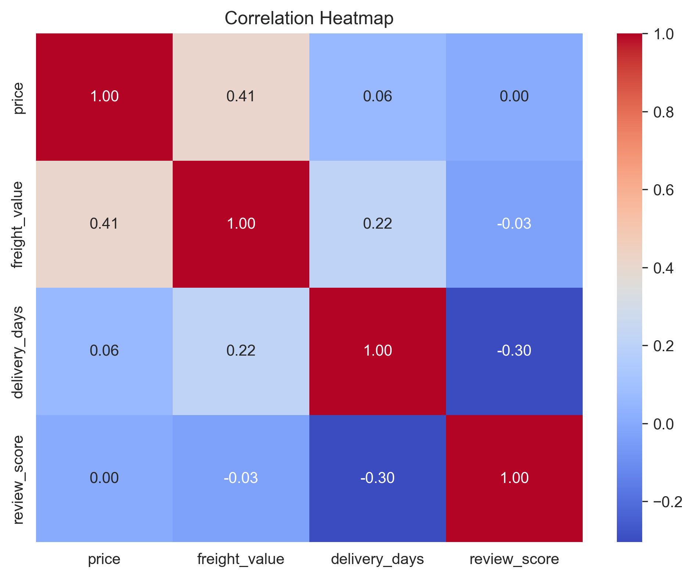 |

### 💡 Insights Chính:
- **Tương quan mạnh giữa cước phí (`freight_value`) và khoảng cách địa lý / khối lượng sản phẩm**.
- **Tương quan âm giữa thời gian giao hàng (`delivery_days`) và điểm đánh giá (`review_score`)**: Thời gian giao hàng càng kéo dài, điểm review càng giảm rõ rệt.
- **Mối quan hệ giữa giá sản phẩm và giá trị thanh toán**: Giá sản phẩm quyết định phần lớn tổng hóa đơn, phí ship chiếm trung bình 15-25% giá trị đơn hàng.

---

## 7. Đề Xuất & Khuyến Nghị Chiến Lược Kinh Doanh

1. **Tối ưu hóa Mạng lưới Logistics & Kho vận (Fulfillment Centers)**:
   - Thành lập các hub kho bãi vệ tinh tại Đông Nam và Nam Brazil để rút ngắn thời gian giao hàng chặng cuối (*Last-mile Delivery*).
   - Tự động hóa hệ thống cảnh báo đơn hàng có nguy cơ chậm trễ để thông báo chủ động cho khách hàng trước khi phát sinh khiếu nại.
2. **Chiến lược Quản lý Danh Mục Sản Phẩm (Category Management)**:
   - Ưu tiên nguồn lực marketing, trợ giá và hợp tác với các nhà bán hàng (*sellers*) thuộc top 20% danh mục cốt lõi (Sức khỏe, Sắc đẹp, Nội thất, Đồng hồ, Phụ kiện IT).
   - Kiểm soát chất lượng sản phẩm đối với các ngành hàng có tỷ lệ đánh giá 1 sao cao.
3. **Chiến Lược Tăng Tỷ Lệ Mua Lại (Customer Retention & Re-engagement)**:
   - Thiết lập chương trình hội viên (Loyalty/Cashback) và cá nhân hóa chiến dịch Email/Voucher dựa trên lịch sử mua sắm.
   - Thúc đẩy chính sách miễn phí vận chuyển (*Free Shipping*) theo giá trị đơn hàng tối thiểu tại khu vực trọng điểm São Paulo.
