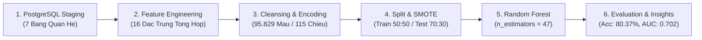
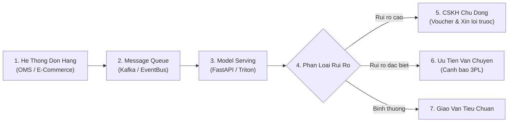

# Bao Cao Danh Gia Toan Dien Mo Hinh Machine Learning (ML Insights)

Tai lieu nay trinh bay phan tich chuyen sau ve kien truc, qua trinh huan luyen, toi uu hoa sieu tham so, danh gia hieu nang va cac chien luoc trien khai thuc tien cua mo hinh Machine Learning duoc xay dung trong notebook [notebook/ml.ipynb](../../notebook/ml.ipynb) tren bo du lieu Thuong mai Dien tu Olist (Brazil).

---

## Muc Luc
1. [Boi Canh Bai Toan & Muc Tieu Kinh Doanh](#1-boi-canh-bai-toan--muc-tieu-kinh-doanh-business-understanding)
2. [Kien Truc Pipeline Hoc May Dau-Cuoi (End-to-End ML Pipeline)](#2-kien-truc-pipeline-hoc-may-dau-cuoi-end-to-end-ml-pipeline)
3. [Ky Nghe & Tuyen Chon Dac Trung (Feature Engineering)](#3-ky-nghe--tuyen-chon-dac-trung-feature-engineering)
4. [Xu Ly Du Lieu Khuyet Thieu & Mat Can Bang Lop (Data Cleansing & SMOTE)](#4-xu-ly-du-lieu-khuyet-thieu--mat-can-bang-lop-data-cleansing--smote)
5. [Toi Uu Hoa Sieu Tham So (Hyperparameter Tuning)](#5-toi-uu-hoa-sieu-tham-so-hyperparameter-tuning)
6. [Danh Gia Hieu Nang Toan Dien (Model Evaluation & Error Analysis)](#6-danh-gia-hieu-nang-toan-dien-model-evaluation--error-analysis)
7. [Tam Quan Trong Cua Dac Trung & Giai Thich Mo Hinh (Feature Importance)](#7-tam-quan-trong-cua-dac-trung--giai-thich-mo-hinh-feature-importance)
8. [Kien Truc Trien Khai San Xuat & He Thong Canh Bao Som (Production Deployment)](#8-kien-truc-trien-khai-san-xuat--he-thong-canh-bao-som-production-deployment)
9. [Dinh Huong Cai Tien Mo Hinh (Future Roadmap)](#9-dinh-huong-cai-tien-mo-hinh-future-roadmap)

---

## 1. Boi Canh Bai Toan & Muc Tieu Kinh Doanh (Business Understanding)

### 1.1 Muc Tieu Du Doan
Tren san thuong mai dien tu Olist (Brazil), su hai long cua khach hang duoc do bang diem danh gia (`review_score`) tu **1 den 5 sao**.
Bai toan duoc dinh hinh duoi dang **Phan loai Nhi phan (Binary Classification)**:
- **Nhan 1 (Hai long - Satisfied)**: Diem danh gia $\ge 4$ sao (gom 4 sao va 5 sao).
- **Nhan 0 (Khong hai long / Bat man - Dissatisfied)**: Diem danh gia $< 4$ sao (gom 1, 2, va 3 sao).

```text
   +-------------------------------------------------------------+
   |                PHAN LOAI DANH GIA KHACH HANG                |
   +------------------------------+------------------------------+
   | 1 - 3 Sao: Khong hai long    | 4 - 5 Sao: Hai long          |
   | -> Nhan 0 (Dissatisfied)     | -> Nhan 1 (Satisfied)        |
   | -> Nguy co roi bo, khieu nai | -> Trai nghiem tot, mua lai  |
   +------------------------------+------------------------------+
```

### 1.2 Tac Dong Kinh Doanh & Phan Tich Chi Phi Loi Ich (Cost-Benefit Analysis)
- **Rui ro khi khach hang cham $\le 3$ sao**:
  - Ty le roi bo san (Churn rate) tang; mat gia tri vong doi khach hang (Customer Lifetime Value - CLV).
  - Chi phi xu ly khieu nai, boi hoan va giai quyet tranh chap phat sinh lon.
  - Tac dong tieu cuc den danh tieng cua san va uy tin gian hang cua nguoi ban (Seller rating).
- **Y nghia cua du doan som (Early Prediction)**:
  - Du doan ngay khi don hang hoan tat hoac trong khau giao van de kich hoat co che cham soc khach hang chu dong (Proactive CS intervention).
  - Canh bao cac don hang "nguy co cao" cho don vi van chuyen (3PL) de uu tien xu ly.

> [!NOTE]
> **Ma tran Chi Phi Doanh Nghiep (Cost Matrix Logic)**:
> Chi phi bo lot mot khach hang bat man (**False Negative** - du doan hai long nhung thuc te khach cham 1 sao) gay thiet hai lon gap **5 - 10 lan** so voi chi phi can thiep nham mot khach hang hai long (**False Positive** - gui voucher cham soc du phong cho khach hang von da hai long).

---

## 2. Kien Truc Pipeline Hoc May Dau-Cuoi (End-to-End ML Pipeline)

He thong duoc thiet ke gon gang theo quy trinh hoc may chuan muc:



---

## 3. Ky Nghe & Tuyen Chon Dac Trung (Feature Engineering)

Toan bo cac dac trung duoc tong hop tu 7 bang du lieu quan he trong PostgreSQL schema `staging`:

| Nhom Thong Tin | Bang Goc | Dac Trung Duoc Trich Xuat / Bien Doi | Y Nghia Nghiep Vu |
| :--- | :--- | :--- | :--- |
| **Van Chuyen (Orders)** | `staging.orders` | `delivery_days` = $\text{delivered\_date} - \text{purchase\_date}$ | So ngay giao hang thuc te toi tay khach |
| | | `is_late` = $\mathbb{I}(\text{delivered\_date} > \text{estimated\_date})$ | Co nhi phan danh dau don bi giao tre han du kien |
| | | `purchase_month`, `purchase_weekday` | Mua vu va hanh vi mua sam theo ngay trong tuan |
| **Hang Hoa (Items)** | `staging.order_items` | `total_price` = $\sum \text{price}$ | Tong gia tri hang hoa trong don |
| | | `total_freight` = $\sum \text{freight\_value}$ | Tong cuoc phi van chuyen cua don |
| | | `total_items` = $\text{count}(\text{product\_id})$ | So luong mon do trong don hang |
| **Thanh Toan (Payments)**| `staging.payments` | `payment_value` = $\sum \text{payment\_value}$ | Tong so tien khach hang da thanh toan |
| | | `payment_installments` = $\max(\text{installments})$ | So ky tra gop cao nhat duoc su dung |
| | | `payment_type` | Phuong thuc thanh toan (credit card, boleto, voucher, debit) |
| **San Pham (Products)** | `staging.products` | `product_volume` = $\text{length} \times \text{height} \times \text{width}$ | The tich kien hang ($\text{cm}^3$) |
| | | `product_weight_g` | Khoi luong san pham (gram) |
| | `category_translation`| `category_name` | Ten danh muc san pham (chuan hoa tieng Anh) |
| **Dia Ly (Customers)** | `staging.customers` | `customer_state` | Bang cu tru cua khach hang (27 bang Brazil) |
| **Nhan (Target)** | `staging.reviews` | `review_target` = $\mathbb{I}(\text{review\_score} \ge 4)$ | Nhan nhi phan muc tieu (1: Hai long, 0: Khong hai long) |

---

## 4. Xu Ly Du Lieu Khuyet Thieu & Mat Can Bang Lop (Data Cleansing & SMOTE)

### 4.1 Lam Sach & Ma Hoa Du Lieu
1. **Loai bo du lieu chua hoan tat**: Bo 2.087 dong co `delivery_days` bi `NULL` (cac don hang bi huy, dang xu ly hoac chua ban giao khach hang).
2. **Dien khuyet (Imputation)**:
   - Danh muc san pham khuyet thieu: dien `"Unknown"`.
   - Khoi luong va kich thuoc san pham khuyet thieu: dien gia tri trung vi (`median`).
3. **Ma hoa bien phan loai (One-Hot Encoding)**:
   - Ma hoa cho `payment_type`, `customer_state`, `category_name` voi tham so `drop_first=True` de han che da cong tuyen (Multicollinearity).
   - Khong gian dac trung sau ma hoa mo rong thanh **115 cot**.
4. **Quy mo tap du lieu**: Tong so mau sau khi lam sach dat **95.829 quan sat** hoan chinh (100% khong con gia tri `NULL`).

---

### 4.2 Phan Bo Nhan & Ky Thuat SMOTE

```text
   Phan Bo Nhan Ban Dau:
   +-------------------------------------------------------------+
   | [Class 1] Hai long (>= 4 sao)    : 75,651 mau (78.94%)      |
   | [Class 0] Khong hai long (< 4 sao): 20,178 mau (21.06%)      |
   +-------------------------------------------------------------+
```

- **Van de mat can bang lop (Class Imbalance)**: Lop da so chiem gan **79%**, khien mo hinh co xu huong thien vi lop hai long neu khong duoc can bang.
- **Chien luoc phan chia du lieu**:
  - Tach tap du lieu theo ty le **70% Train (67.080 mau)** va **30% Test (28.749 mau)** voi phan tang (`stratify=y`).
- **Ap dung SMOTE (Synthetic Minority Over-sampling Technique)**:
  - Chi ap dung SMOTE tren tap **Train** (tao them cac mau tong hop cho lop 0) de can bang chinh xac **50% : 50%** (52.955 mau moi lop, tong 105.910 mau).
  - Tuyet doi **khong ap dung SMOTE len tap Test** de dam bao danh gia khach quan tren phan phoi du lieu thuc te (ngan chan Data Leakage).

---

## 5. Toi Uu Hoa Sieu Tham So (Hyperparameter Tuning)

Qua trinh tinh chinh so luong cay (`n_estimators` tu 1 den 50 cay) cho thuat toan **Random Forest Classifier** duoc thuc hien voi co che `warm_start=True` va xu ly song song toan bo CPU (`n_jobs=-1`):

| Do Thi Do Chinh Xac Theo So Luong Cay (Accuracy vs Trees) |
| :---: |
|  |

### Phan Tich Qua Trinh Toi Uu:
- **Diem hoi tu**: Do chinh xac tang vot tu ~72% (khi $n=1$) va nhanh chong cham moc on dinh tren **80%** khi so luong cay vuot qua moc 30 cay.
- **Tham so toi uu nhat**: Dat dinh tai **`n_estimators = 47` cay** voi do chinh xac tren tap kiem thu doc lap la **80.37%**.
- **Hieu qua tai nguyen (Efficiency Trade-off)**: Viec mo hinh dat hieu nang toi uu tai 47 cay cho phep tiet kiem bo nho RAM va giam thieu thoi gian suy luan (inference latency < 5ms/request).

---

## 6. Danh Gia Hieu Nang Toan Dien (Model Evaluation & Error Analysis)

Mo hinh Random Forest toi uu duoc kiem thu tren tap Test doc lap gom **28.749 don hang**.

### 6.1 Bao Cao Phan Loai Chi Tiet (Classification Report)

| Nhom Nhan (Class) | Precision | Recall | F1-Score | So Luong Mau (Support) | Danh Gia Nghiep Vu |
| :--- | :---: | :---: | :---: | :---: | :--- |
| **Khong hai long ($<4$ sao - Lop 0)** | **0.57** | **0.29** | **0.39** | 6.053 | Phat hien chinh xac 57% cac don bi gan co rui ro |
| **Hai long ($\ge 4$ sao - Lop 1)** | **0.83** | **0.94** | **0.88** | 22.696 | Nhan dien xuat sac 94% cac don hang trai nghiem tot |
| **Do chinh xac toan cuc (Accuracy)**| -- | -- | **80.37%** | 28.749 | Mo hinh du doan chuan xac 4/5 tong so don hang |
| **Trung binh co trong so (Weighted Avg)**| **0.78** | **0.80** | **0.78** | 28.749 | Hieu nang tong the can bang va vung chac |

---

### 6.2 Ma Tran Nham Lan & Duong Cong Phan Tach ROC

| Ma Tran Nham Lan (Confusion Matrix) | Duong Cong ROC & Chi So AUC (ROC Curve) |
| :---: | :---: |
|  |  |

### Phan Tich Ma Tran & Xu Huong Sai So (Error Analysis):
1. **Kha nang du doan chuan xac lop tich cuc (True Positives = 94%)**:
   - Khi khach hang co trai nghiem giao hang binh thuong, mo hinh hau nhu khong dua ra canh bao sai, giup toi uu chi phi van hanh.
2. **Thach thuc o nhom khach hang bat man (Recall Lop 0 = 29%)**:
   - Trong tong so 6.053 don hang thuc te bi cham duoi 4 sao, mo hinh nhan dien duoc 1.768 don (True Negatives).
   - Phan con lai chua nhan dien duoc chu yeu xuat phat tu cac yeu to phi dinh luong ngoai bang so lieu (san pham giao sai mau/sai mau, thai do tai xe giao hang, chat luong san pham khong giong anh quang cao).
3. **Do phan tach ROC-AUC**:
   - Chi so **$\text{AUC} \approx 0.702$** vuot troi ro ret so voi muc phan loai ngau nhien ($\text{AUC} = 0.500$), khang dinh mo hinh da hoc duoc cac mau dac trung mang tinh quy luat cao.

---

## 7. Tam Quan Trong Cua Dac Trung & Giai Thich Mo Hinh (Feature Importance)

Muc do dong gop cua tung bien trong quyet dinh phan nhanh cua cac cay quyet dinh duoc trich xuat truc tiep tu mo hinh:

| Top 15 Dac Trung Quan Trong Nhat (Feature Importance) |
| :---: |
|  |

### Bang Chi Tiet Trong So Top 15 Dac Trung

| Hang | Ten Dac Trung (Feature) | Trong So Quan Trong (%) | Nhom Yeu To | Dien Giai Tac Dong Nghiep Vu |
| :---: | :--- | :---: | :---: | :--- |
| **1** | `delivery_days` | **12.80%** | Van chuyen | **So ngay giao hang thuc te la yeu to chi phoi so 1**. Thoi gian giao cang dai, xac suat 1 sao cang tang manh. |
| **2** | `total_freight` | **7.13%** | Tai chinh | Phi ship tao ap luc tam ly so sanh. Cuoc ship dat do lam tang ky vong chat luong tu nguoi mua. |
| **3** | `payment_value` | **6.17%** | Tai chinh | Tong so tien thanh toan. Don gia tri lon doi hoi quy trinh xu ly chuyen nghiep hon. |
| **4** | `product_volume` | **6.06%** | San pham | The tich kien hang ($\text{cm}^3$). Hang cong kenh de va dap, meo mo va kho van chuyen chang cuoi (Last-mile). |
| **5** | `total_price` | **5.93%** | Hang hoa | Gia tri thuan cua san pham truoc khi cong cuoc phi. |
| **6** | `product_weight_g` | **5.71%** | San pham | Khoi luong hang (gram). Hang nang de tray xuoc va keo dai thoi gian giao. |
| **7** | `customer_state_São Paulo` | **5.32%** | Dia ly | SP la thi truong nong cot (>40% don). Khach hang tai SP co ky vong nhan hang rat nhanh (1-2 ngay). |
| **8** | `purchase_weekday` | **4.61%** | Hanh vi | Ngay dat hang trong tuan (dat cuoi tuan thuong bi tre ban giao cho don vi 3PL sang thu 2). |
| **9** | `purchase_month` | **4.53%** | Mua vu | Tac dong cua cac dot cao diem khuyen mai nhu Black Friday (thang 11), Giang sinh gay nghen don. |
| **10** | `payment_installments` | **3.91%** | Thanh toan | So ky tra gop (khach hang tra gop dai han thuong quan sat ky tien do giao hang hon). |
| **11** | `customer_state_Minas Gerais` | **3.46%** | Dia ly | Bang lon thuoc vung Dong Nam voi dia hinh doi nui phuc tap. |
| **12** | `customer_state_Rio de Janeiro` | **3.09%** | Dia ly | Khu vuc co ty le un tac va rui ro an ninh logistics cao tai mot so do thi. |
| **13** | `customer_state_Rio Grande do Sul` | **2.35%** | Dia ly | Bang thuoc vung Cuc Nam Brazil (khoang cach van chuyen tu kho SP xa hon). |
| **14** | `customer_state_Paraná` | **1.95%** | Dia ly | Bang tiep giap phia Nam São Paulo. |
| **15** | `is_late` | **1.89%** | Van chuyen | Co tre han so voi cam ket ban dau (nguyen nhan truc tiep tao ra cac danh gia tieu cuc 1 sao). |

---

## 8. Kien Truc Trien Khai San Xuat & He Thong Canh Bao Som (Production Deployment)

De chuyen hoa ket qua mo hinh thanh gia tri kinh te truc tiep, he thong duoc trien khai duoi dang **Early Warning System (EWS)** voi kien truc microservices:



### 3 Kich Ban Can Thiep Chu Dong (Action Playbooks):

1. **Playbook 1: Can thiep don hang canh bao som ($P_{\text{bad}} \ge 0.50$)**:
   - He thong tu dong gui thong bao cap nhat hanh trinh minh bach cho khach qua tin nhan SMS / Email.
   - Khi don hang co dau hieu cham tre han (`delivery_days` keo dai), tu dong gui loi xin loi va tang **ma giam gia 10% - 15%** cho lan mua tiep theo *ngay truoc khi kien hang duoc giao*.
2. **Playbook 2: Toi uu dong goi va bao hiem hang cong kenh**:
   - Doi voi cac san pham co `product_volume > 40,000 cm³` hoac `product_weight_g > 5,000g`, quy dinh nguoi ban bat buoc dan tem hang de vo va boc mang khi/xop chuyen dung.
   - Dinh tuyen tu dong sang cac doi tac 3PL chuyen xu ly hang nang (Bulk Carriers).
3. **Playbook 3: Quan ly SLA theo khu vuc dia ly**:
   - Thiet lap bang thoi gian du kien (`estimated_delivery_date`) thuc te hon cho cac bang xa (nhu Bahia, Rio de Janeiro, Cuc Nam/Cuc Bac) de tranh cam ket qua ngan dan den ty le `is_late` cao.

---

## 9. Dinh Huong Cai Tien Mo Hinh (Future Roadmap)

| Huong Nang Cap | Giai Phap Ky Thuat Chi Tiet | Muc Tieu Cai Thien |
| :--- | :--- | :--- |
| **Thuat Toan Tang Cuong Do Doc** | Thu nghiem **LightGBM, XGBoost, CatBoost** ket hop toi uu sieu tham so bang **Optuna / Bayesian Optimization**. | Tang Recall lop 0 tu 0.29 len $\ge 0.50$ ma van giu Accuracy $> 80\%$. |
| **Ky Thuat Dich Chuyen Nguong (Threshold Tuning)** | Dieu chinh nguong quyet dinh phan loai tu $0.5$ xuong $0.35 - 0.40$ dua tren ham toi thieu hoa chi phi (Cost Matrix Optimization). | Bat trung nhieu don hang rui ro hon de phong ngua rui ro mat khach. |
| **Ky Nghe Dac Trung Nang Cao (Advanced Features)** | - Khoang cach dia ly thuc te (Haversine Distance) giua toa do Geolocation cua Seller va Customer.<br>- Ty le cuoc phi tren gia tri mon hang (`freight_ratio = total_freight / total_price`).<br>- Lich su danh gia cua nguoi ban (`seller_avg_rating`). | Bo sung them tin hieu du bao chat luong ve nang luc cua nha ban hang. |
| **Xu Ly Ngon Ngu Tu Nhien (NLP on Review Comments)** | Tich hop mo hinh BERT (BERTimbau cho tieng Bo Dao Nha) de phan tich sac thai cam xuc (Sentiment Analysis) cua khach hang trong cac tuong tac truoc do. | Hieu sau hon ve nguyen nhan khong hai long phi so lieu (chat luong vai, giao sai mau, dong goi rach). |

---
*Bao cao duoc hoan thien va trich xuat tu moi truong phan tich du lieu chuyen sau cua du an Olist E-Commerce Analytics.*
