# 🤖 Báo Cáo Đánh Giá Toàn Diện Mô Hình Machine Learning (ML Insights)

Tài liệu này trình bày phân tích chuyên sâu về kiến trúc, quá trình huấn luyện, tối ưu hóa siêu tham số, đánh giá hiệu năng và các chiến lược triển khai thực tiễn của mô hình Machine Learning được xây dựng trong notebook [`notebook/ml.ipynb`](../../notebook/ml.ipynb) trên bộ dữ liệu Thương mại Điện tử Olist (Brazil).

---

## 📑 Mục Lục
1. [Bối Cảnh Bài Toán & Mục Tiêu Kinh Doanh](#1-bối-cảnh-bài-toán--mục-tiêu-kinh-doanh-business-understanding)
2. [Kiến Trúc Pipeline Học Máy Đầu-Cuối (End-to-End ML Pipeline)](#2-kiến-trúc-pipeline-học-máy-đầu-cuối-end-to-end-ml-pipeline)
3. [Kỹ Nghệ & Tuyển Chọn Đặc Trưng (Feature Engineering)](#3-kỹ-nghệ--tuyển-chọn-đặc-trưng-feature-engineering)
4. [Xử Lý Dữ Liệu Khuyết Thiếu & Mất Cân Bằng Lớp (Data Cleansing & SMOTE)](#4-xử-lý-dữ-liệu-khuyết-thiếu--mất-cân-bằng-lớp-data-cleansing--smote)
5. [Tối Ưu Hóa Siêu Tham Số (Hyperparameter Tuning)](#5-tối-ưu-hóa-siêu-tham-số-hyperparameter-tuning)
6. [Đánh Giá Hiệu Năng Toàn Diện (Model Evaluation & Error Analysis)](#6-đánh-giá-hiệu-năng-toàn-diện-model-evaluation--error-analysis)
7. [Tầm Quan Trọng Của Đặc Trưng & Giải Thích Mô Hình (Feature Importance)](#7-tầm-quan-trọng-của-đặc-trưng--giải-thích-mô-hình-feature-importance)
8. [Kiến Trúc Triển Khai Sản Xuất & Hệ Thống Cảnh Báo Sớm (Production Deployment)](#8-kiến-trúc-triển-khai-sản-xuất--hệ-thống-cảnh-báo-sớm-production-deployment)
9. [Định Hướng Cải Tiến Mô Hình (Future Roadmap)](#9-định-hướng-cải-tiến-mô-hình-future-roadmap)

---

## 1. Bối Cảnh Bài Toán & Mục Tiêu Kinh Doanh (Business Understanding)

### 🎯 1.1 Mục Tiêu Dự Đoán
Trên sàn thương mại điện tử Olist (Brazil), sự hài lòng của khách hàng được đo bằng điểm đánh giá (`review_score`) từ **1 đến 5 sao**.
Bài toán được định hình dưới dạng **Phân loại Nhị phân (Binary Classification)**:
- **Nhãn `1` (Hài lòng - Satisfied)**: Điểm đánh giá $ \ge 4 $ sao (gồm 4 sao và 5 sao).
- **Nhãn `0` (Không hài lòng / Bất mãn - Dissatisfied)**: Điểm đánh giá $ < 4 $ sao (gồm 1, 2, và 3 sao).

```
   ┌──────────────────────────────────────────────────────────────┐
   │                 PHÂN LOẠI ĐÁNH GIÁ KHÁCH HÀNG                │
   ├──────────────────────────────┬───────────────────────────────┤
   │ 🌟 1 - 3 Sao: Không hài lòng │ 🌟 4 - 5 Sao: Hài lòng        │
   │  → Nhãn 0 (Dissatisfied)     │  → Nhãn 1 (Satisfied)         │
   │  → Nguy cơ rời bỏ, khiếu nại │  → Trải nghiệm tốt, mua lại   │
   └──────────────────────────────┴───────────────────────────────┘
```

### 💼 1.2 Tác Động Kinh Doanh & Phân Tích Chi Phí Lợi Ích (Cost-Benefit Analysis)
- **Rủi ro khi khách hàng chấm $\le 3$ sao**:
  - Tỷ lệ rời bỏ sàn (*Churn rate*) tăng vọt; mất giá trị vòng đời khách hàng (*Customer Lifetime Value - CLV*).
  - Chi phí xử lý khiếu nại, bồi hoàn và giải quyết tranh chấp phát sinh lớn.
  - Tác động tiêu cực đến danh tiếng của sàn và uy tín gian hàng của người bán (*Seller rating*).
- **Ý nghĩa của dự đoán sớm (Early Prediction)**:
  - Dự đoán ngay khi đơn hàng hoàn tất hoặc ngay trong khâu giao vận để kích hoạt cơ chế chăm sóc khách hàng chủ động (*Proactive CS intervention*).
  - Cảnh báo các đơn hàng "nguy cơ cao" cho đơn vị vận chuyển (3PL) để ưu tiên thông quan/chuyển phát nhanh.

> [!NOTE]
> **Ma trận Chi Phí Doanh Nghiệp (Cost Matrix Logic)**:
> Chi phí bỏ lọt một khách hàng bất mãn (**False Negative** - dự đoán hài lòng nhưng thực tế khách chấm 1 sao) gây thiệt hại lớn gấp **5 - 10 lần** so với chi phí can thiệp nhầm một khách hàng hài lòng (**False Positive** - gửi voucher chăm sóc dự phòng cho khách hàng vốn đã hài lòng).

---

## 2. Kiến Trúc Pipeline Học Máy Đầu-Cuối (End-to-End ML Pipeline)

Hệ thống được thiết kế theo quy trình Machine Learning chuẩn mực và khép kín:

```mermaid
flowchart TD
    subgraph Data_Source ["1. Nguồn Dữ Liệu (Database Staging Schema)"]
        O[staging.orders]
        OI[staging.order_items]
        P[staging.payments]
        PR[staging.products]
        CT[staging.category_translation]
        C[staging.customers]
        R[staging.reviews]
    end

    subgraph Feature_Engineering ["2. Kỹ Nghệ Đặc Trưng (Feature Engineering)"]
        F1["Thời gian vận chuyển & Cờ trễ hạn (delivery_days, is_late)"]
        F2["Tổng tiền hàng, cước ship, số mặt hàng (total_price, total_freight, total_items)"]
        F3["Phương thức, giá trị, số kỳ trả góp (payment_value, installments, type)"]
        F4["Kích thước, thể tích, khối lượng, danh mục (volume, weight, category)"]
        F5["Địa lý người nhận (customer_state)"]
    end

    subgraph Preprocessing ["3. Tiền Xử Lý & Làm Sạch (Data Cleansing)"]
        M1["Loại bỏ đơn chưa giao (delivery_days NULL)"]
        M2["Impute giá trị khuyết (Median & Unknown)"]
        M3["One-Hot Encoding (115 chiều đặc trưng)"]
    end

    subgraph Resampling ["4. Phân Chia & Cân Bằng Dữ Liệu (Split & Resampling)"]
        S1["Stratified Train/Test Split (70/30)"]
        S2["SMOTE (Cân bằng lớp 50:50 trên Train)"]
    end

    subgraph Modeling ["5. Huấn Luyện & Đánh Giá (Modeling & Evaluation)"]
        RF["Random Forest Classifier (warm_start, n_jobs=-1)"]
        Tuning["Hyperparameter Tuning: n_estimators (1..50)"]
        Eval["Confusion Matrix, ROC Curve, Precision/Recall/F1"]
        FI["Feature Importance Analysis (Top 15 Features)"]
    end

    Data_Source --> Feature_Engineering
    Feature_Engineering --> Preprocessing
    Preprocessing --> Resampling
    Resampling --> Modeling
```



---

## 3. Kỹ Nghệ & Tuyển Chọn Đặc Trưng (Feature Engineering)

Toàn bộ các đặc trưng được tổng hợp từ 7 bảng dữ liệu quan hệ trong PostgreSQL schema `staging`:

| Nhóm Thông Tin | Bảng Gốc | Đặc Trưng Được Trích Xuất / Biến Đổi | Ý Nghĩa Nghiệp Vụ |
| :--- | :--- | :--- | :--- |
| **Vận Chuyển (Orders)** | `staging.orders` | `delivery_days` = $ \text{delivered\_date} - \text{purchase\_date} $ | Số ngày giao hàng thực tế tới tay khách |
| | | `is_late` = $ \mathbb{I}(\text{delivered\_date} > \text{estimated\_date}) $ | Cờ nhị phân đánh dấu đơn bị giao trễ hạn dự kiến |
| | | `purchase_month`, `purchase_weekday` | Mùa vụ và hành vi mua sắm theo ngày trong tuần |
| **Hàng Hóa (Items)** | `staging.order_items` | `total_price` = $ \sum \text{price} $ | Tổng giá trị hàng hóa trong đơn |
| | | `total_freight` = $ \sum \text{freight\_value} $ | Tổng cước phí vận chuyển của đơn |
| | | `total_items` = $ \text{count}(\text{product\_id}) $ | Số lượng món đồ trong đơn hàng |
| **Thanh Toán (Payments)**| `staging.payments` | `payment_value` = $ \sum \text{payment\_value} $ | Tổng số tiền khách hàng đã thanh toán |
| | | `payment_installments` = $ \max(\text{installments}) $ | Số kỳ trả góp cao nhất được sử dụng |
| | | `payment_type` | Phương thức thanh toán (credit card, boleto, voucher, debit) |
| **Sản Phẩm (Products)** | `staging.products` | `product_volume` = $ \text{length} \times \text{height} \times \text{width} $ | Thể tích kiện hàng ($ \text{cm}^3 $) |
| | | `product_weight_g` | Khối lượng sản phẩm (gram) |
| | `category_translation`| `category_name` | Tên danh mục sản phẩm (chuẩn hóa tiếng Anh) |
| **Địa Lý (Customers)** | `staging.customers` | `customer_state` | Bang cư trú của khách hàng (27 bang Brazil) |
| **Nhãn (Target)** | `staging.reviews` | `review_target` = $ \mathbb{I}(\text{review\_score} \ge 4) $ | Nhãn nhị phân mục tiêu (1: Hài lòng, 0: Không hài lòng) |

---

## 4. Xử Lý Dữ Liệu Khuyết Thiếu & Mất Cân Bằng Lớp (Data Cleansing & SMOTE)

### 🧹 4.1 Làm Sạch & Mã Hóa Dữ Liệu
1. **Loại bỏ dữ liệu chưa hoàn tất**: Bỏ 2.087 dòng có `delivery_days` bị `NULL` (các đơn hàng bị hủy, đang xử lý hoặc chưa bàn giao khách hàng).
2. **Điền khuyết (Imputation)**:
   - Danh mục sản phẩm khuyết thiếu: điền `"Unknown"`.
   - Khối lượng và kích thước sản phẩm khuyết thiếu: điền giá trị trung vị (`median`).
3. **Mã hóa biến phân loại (One-Hot Encoding)**:
   - Mã hóa cho `payment_type`, `customer_state`, `category_name` với tham số `drop_first=True` để hạn chế đa cộng tuyến (*Multicollinearity*).
   - Không gian đặc trưng sau mã hóa mở rộng thành **115 cột**.
4. **Quy mô tập dữ liệu**: Tổng số mẫu sau khi làm sạch đạt **95.829 quan sát** hoàn chỉnh (100% không còn giá trị `NULL`).

---

### ⚖️ 4.2 Phân Bổ Nhãn & Kỹ Thuật SMOTE

```
   Phân Bổ Nhãn Ban Đầu:
   ┌─────────────────────────────────────────────────────────────┐
   │ 🟩 Hài lòng (>=4 sao)    : 75,651 mẫu (78.94%)              │
   │ 🟥 Không hài lòng (<4 sao): 20,178 mẫu (21.06%)              │
   └─────────────────────────────────────────────────────────────┘
```

- **Vấn đề mất cân bằng lớp (Class Imbalance)**: Lớp đa số chiếm gần **79%**, khiến mô hình có xu hướng thiên vị lớp hài lòng nếu không được cân bằng.
- **Chiến lược phân chia dữ liệu**:
  - Tách tập dữ liệu theo tỷ lệ **70% Train (67.080 mẫu)** và **30% Test (28.749 mẫu)** với phân tầng (`stratify=y`).
- **Áp dụng SMOTE (Synthetic Minority Over-sampling Technique)**:
  - Chỉ áp dụng SMOTE trên tập **Train** (tạo thêm các mẫu tổng hợp cho lớp 0) để cân bằng chính xác **50% : 50%** (52.955 mẫu mỗi lớp, tổng 105.910 mẫu).
  - Tuyệt đối **không áp dụng SMOTE lên tập Test** để đảm bảo đánh giá khách quan trên phân phối dữ liệu thực tế ngoài đời thực (ngăn chặn *Data Leakage*).

---

## 5. Tối Ưu Hóa Siêu Tham Số (Hyperparameter Tuning)

Quá trình tinh chỉnh số lượng cây (`n_estimators` từ 1 đến 50 cây) cho thuật toán **Random Forest Classifier** được thực hiện với cơ chế `warm_start=True` và xử lý song song toàn bộ CPU (`n_jobs=-1`):

| Đồ Thị Độ Chính Xác Theo Số Lượng Cây (Accuracy vs Trees) |
| :---: |
|  |

### 💡 Phân Tích Quá Trình Tối Ưu:
- **Điểm hội tụ**: Độ chính xác tăng vọt từ ~72% (khi $n=1$) và nhanh chóng chạm mốc ổn định trên **80%** khi số lượng cây vượt qua mốc 30 cây.
- **Tham số tối ưu nhất**: Đạt đỉnh tại **`n_estimators = 47` cây** với độ chính xác trên tập kiểm thử độc lập là **80.37%**.
- **Hiệu quả tài nguyên (Efficiency Trade-off)**: Việc mô hình đạt hiệu năng tối ưu tại 47 cây cho phép tiết kiệm đáng kể bộ nhớ RAM và giảm thiểu thời gian suy luận (*inference latency < 5ms/request*), rất lý tưởng cho việc triển khai API trực tuyến.

---

## 6. Đánh Giá Hiệu Năng Toàn Diện (Model Evaluation & Error Analysis)

Mô hình Random Forest tối ưu được kiểm thử trên tập Test độc lập gồm **28.749 đơn hàng**.

### 📊 6.1 Báo Cáo Phân Loại Chi Tiết (Classification Report)

| Nhóm Nhãn (Class) | Precision | Recall | F1-Score | Số Lượng Mẫu (Support) | Đánh Giá Nghiệp Vụ |
| :--- | :---: | :---: | :---: | :---: | :--- |
| **Không hài lòng ($<4$ sao - Lớp 0)** | **0.57** | **0.29** | **0.39** | 6.053 | Phát hiện chính xác 57% các đơn bị gắn cờ rủi ro |
| **Hài lòng ($\ge 4$ sao - Lớp 1)** | **0.83** | **0.94** | **0.88** | 22.696 | Nhận diện xuất sắc 94% các đơn hàng trải nghiệm tốt |
| **Độ chính xác toàn cục (Accuracy)**| — | — | **80.37%** | 28.749 | Mô hình dự đoán chuẩn xác 4/5 tổng số đơn hàng |
| **Trung bình có trọng số (Weighted Avg)**| **0.78** | **0.80** | **0.78** | 28.749 | Hiệu năng tổng thể cân bằng và vững chắc |

---

### 🔍 6.2 Ma Trận Nhầm Lẫn & Đường Cong Phân Tách ROC

| Ma Trận Nhầm Lẫn (Confusion Matrix) | Đường Cong ROC & Chỉ Số AUC (ROC Curve) |
| :---: | :---: |
|  |  |

### 💡 Phân Tích Ma Trận & Xu Hướng Sai Số (Error Analysis):
1. **Khả năng dự đoán chuẩn xác lớp tích cực (True Positives = 94%)**:
   - Khi khách hàng có trải nghiệm giao hàng bình thường, mô hình hầu như không đưa ra cảnh báo sai, giúp tối ưu chi phí vận hành không cần thiết.
2. **Thách thức ở nhóm khách hàng bất mãn (Recall Lớp 0 = 29%)**:
   - Trong tổng số 6.053 đơn hàng thực tế bị chấm dưới 4 sao, mô hình nhận diện được 1.768 đơn (True Negatives).
   - Phần còn lại chưa nhận diện được chủ yếu xuất phát từ các yếu tố phi định lượng không có trong bảng số liệu có sẵn (ví dụ: sản phẩm giao sai màu/sai mẫu, thái độ tài xế giao hàng, chất lượng sản phẩm không giống ảnh quảng cáo).
3. **Độ phân tách ROC-AUC**:
   - Chỉ số **$ \text{AUC} \approx 0.702 $** vượt trội rõ rệt so với mức phân loại ngẫu nhiên ($ \text{AUC} = 0.500 $), khẳng định mô hình đã học được các mẫu đặc trưng mang tính quy luật cao.

---

## 7. Tầm Quan Trọng Của Đặc Trưng & Giải Thích Mô Hình (Feature Importance)

Mức độ đóng góp của từng biến trong quyết định phân nhánh của các cây quyết định được trích xuất trực tiếp từ mô hình:

| Top 15 Đặc Trưng Quan Trọng Nhất (Feature Importance) |
| :---: |
|  |

### 📋 Bảng Chi Tiết Trọng Số Top 15 Đặc Trưng

| Hạng | Tên Đặc Trưng (Feature) | Trọng Số Quan Trọng (%) | Nhóm Yếu Tố | Diễn Giải Tác Động Nghiệp Vụ |
| :---: | :--- | :---: | :---: | :--- |
| **1** | `delivery_days` | **12.80%** | Vận chuyển | **Số ngày giao hàng thực tế là yếu tố chi phối số 1**. Thời gian giao càng dài, xác suất 1 sao càng tăng theo cấp số nhân. |
| **2** | `total_freight` | **7.13%** | Tài chính | Phí ship tạo áp lực tâm lý so sánh. Cước ship đắt đỏ làm tăng kỳ vọng chất lượng từ phía người mua. |
| **3** | `payment_value` | **6.17%** | Tài chính | Tổng số tiền thanh toán. Đơn giá trị lớn đòi hỏi quy trình xử lý chuyên nghiệp hơn. |
| **4** | `product_volume` | **6.06%** | Sản phẩm | Thể tích kiện hàng ($ \text{cm}^3 $). Hàng cồng kềnh dễ va đập, méo mó và khó vận chuyển chặng cuối (*Last-mile*). |
| **5** | `total_price` | **5.93%** | Hàng hóa | Giá trị thuần của sản phẩm trước khi cộng cước phí. |
| **6** | `product_weight_g` | **5.71%** | Sản phẩm | Khối lượng hàng (gram). Hàng nặng dễ trầy xước, chi phí bốc dỡ cao và kéo dài thời gian giao. |
| **7** | `customer_state_São Paulo` | **5.32%** | Địa lý | SP là thị trường nòng cốt (>40% đơn). Khách hàng tại SP có kỳ vọng nhận hàng cực nhanh (1-2 ngày). |
| **8** | `purchase_weekday` | **4.61%** | Hành vi | Ngày đặt hàng trong tuần (đặt cuối tuần thường bị trễ bàn giao cho đơn vị 3PL sang thứ 2). |
| **9** | `purchase_month` | **4.53%** | Mùa vụ | Tác động của các đợt cao điểm khuyến mãi như Black Friday (tháng 11), Giáng sinh gây nghẽn đơn. |
| **10** | `payment_installments` | **3.91%** | Thanh toán | Số kỳ trả góp (khách hàng trả góp dài hạn thường quan sát kỹ tiến độ giao hàng hơn). |
| **11** | `customer_state_Minas Gerais` | **3.46%** | Địa lý | Bang lớn thuộc vùng Đông Nam với địa hình đồi núi phức tạp. |
| **12** | `customer_state_Rio de Janeiro` | **3.09%** | Địa lý | Khu vực có tỷ lệ ùn tắc và rủi ro an ninh logistics cao tại một số đô thị. |
| **13** | `customer_state_Rio Grande do Sul` | **2.35%** | Địa lý | Bang thuộc vùng Cực Nam Brazil (khoảng cách vận chuyển từ kho SP xa hơn). |
| **14** | `customer_state_Paraná` | **1.95%** | Địa lý | Bang tiếp giáp phía Nam São Paulo. |
| **15** | `is_late` | **1.89%** | Vận chuyển | Cờ trễ hạn so với cam kết ban đầu (nguyên nhân trực tiếp tạo ra các đánh giá tiêu cực 1 sao). |

---

## 8. Kiến Trúc Triển Khai Sản Xuất & Hệ Thống Cảnh Báo Sớm (Production Deployment)

Để chuyển hóa kết quả mô hình thành giá trị kinh tế trực tiếp, đề xuất triển khai hệ thống **Early Warning System (EWS)** theo kiến trúc microservices:

```mermaid
flowchart LR
    A["Hệ Thống Đơn Hàng (OMS / E-Commerce)"] -->|Event: Order Shipped/In Transit| B["Message Queue (Kafka / RabbitMQ)"]
    B --> C["ML Inference Service (FastAPI / Docker)"]
    C -->|Lookup Features| D[("Feature Store / Redis Cache")]
    C -->|Calculate Probability P_bad| E{"Ngưỡng Rủi Ro (Risk Threshold)"}
    E -->|P_bad >= 0.50 (High Risk)| F["Kích Hoạt CSKH Chủ Động (CRM / Zendesk)"]
    E -->|P_bad >= 0.70 (Critical Risk)| G["Cảnh Báo Đơn Vị Vận Chuyển 3PL"]
    E -->|P_bad < 0.50 (Normal)| H["Theo Dõi Vận Chuyển Tiêu Chuẩn"]
    F --> I["Gửi SMS/Voucher Bù Đắp Trước Khi Giao"]
```

### 📋 3 Kịch Bản Can Thiệp Chủ Động (Action Playbooks):

1. **Playbook 1: Can thiệp đơn hàng cảnh báo sớm ($ P_{\text{bad}} \ge 0.50 $)**:
   - Hệ thống tự động gửi thông báo cập nhật hành trình minh bạch cho khách qua tin nhắn SMS / Email.
   - Khi đơn hàng có dấu hiệu chạm trễ hạn (`delivery_days` kéo dài), tự động gửi lời xin lỗi và tặng **mã giảm giá 10% - 15%** cho lần mua tiếp theo *ngay trước khi kiện hàng được giao*.
2. **Playbook 2: Tối ưu đóng gói và bảo hiểm hàng cồng kềnh**:
   - Đối với các sản phẩm có `product_volume > 40,000 cm³` hoặc `product_weight_g > 5,000g`, quy định người bán bắt buộc dán tem hàng dễ vỡ và bọc màng khí/xốp chuyên dụng.
   - Định tuyến tự động sang các đối tác 3PL chuyên xử lý hàng nặng (Bulk Carriers).
3. **Playbook 3: Quản lý SLA theo khu vực địa lý**:
   - Thiết lập bảng thời gian dự kiến (`estimated_delivery_date`) thực tế hơn cho các bang xa (như Bahia, Rio de Janeiro, Cực Nam/Cực Bắc) để tránh cam kết quá ngắn dẫn đến tỷ lệ `is_late` cao.

---

## 9. Định Hướng Cải Tiến Mô Hình (Future Roadmap)

| Hướng Nâng Cấp | Giải Pháp Kỹ Thuật Chi Tiết | Mục Tiêu Cải Thiện |
| :--- | :--- | :--- |
| **Thuật Toán Tăng Cường Độ Dốc** | Thử nghiệm **LightGBM, XGBoost, CatBoost** kết hợp tối ưu siêu tham số bằng **Optuna / Bayesian Optimization**. | Tăng Recall lớp 0 từ 0.29 lên $\ge 0.50$ mà vẫn giữ Accuracy $> 80\%$. |
| **Kỹ Thuật Dịch Chuyển Ngưỡng (Threshold Tuning)** | Điều chỉnh ngưỡng quyết định phân loại từ $0.5$ xuống $0.35 - 0.40$ dựa trên hàm tối thiểu hóa chi phí (Cost Matrix Optimization). | Bắt trúng nhiều đơn hàng rủi ro hơn để phòng ngừa rủi ro mất khách. |
| **Kỹ Nghệ Đặc Trưng Nâng Cao (Advanced Features)** | - Khoảng cách địa lý thực tế (Haversine Distance) giữa tọa độ Geolocation của Seller và Customer.<br>- Tỷ lệ cước phí trên giá trị món hàng (`freight_ratio = total_freight / total_price`).<br>- Lịch sử đánh giá của người bán (`seller_avg_rating`). | Bổ sung thêm tín hiệu dự báo chất lượng về năng lực của nhà bán hàng. |
| **Xử Lý Ngôn Ngữ Tự Nhiên (NLP on Review Comments)** | Tích hợp mô hình BERT (BERTimbau cho tiếng Bồ Đào Nha) để phân tích sắc thái cảm xúc (*Sentiment Analysis*) của khách hàng trong các tương tác trước đó. | Hiểu sâu hơn về nguyên nhân không hài lòng phi số liệu (chất lượng vải, giao sai màu, đóng gói rách). |

---
*Báo cáo được hoàn thiện và trích xuất từ môi trường phân tích dữ liệu chuyên sâu của dự án Olist E-Commerce Analytics.*
