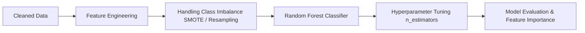
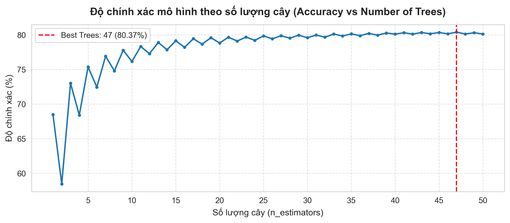
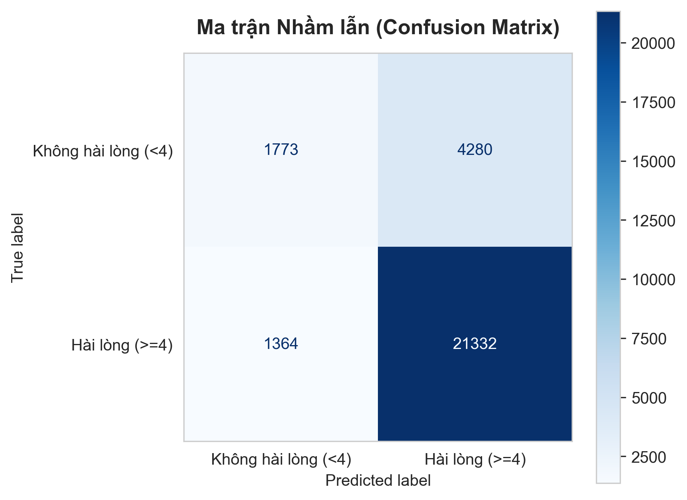
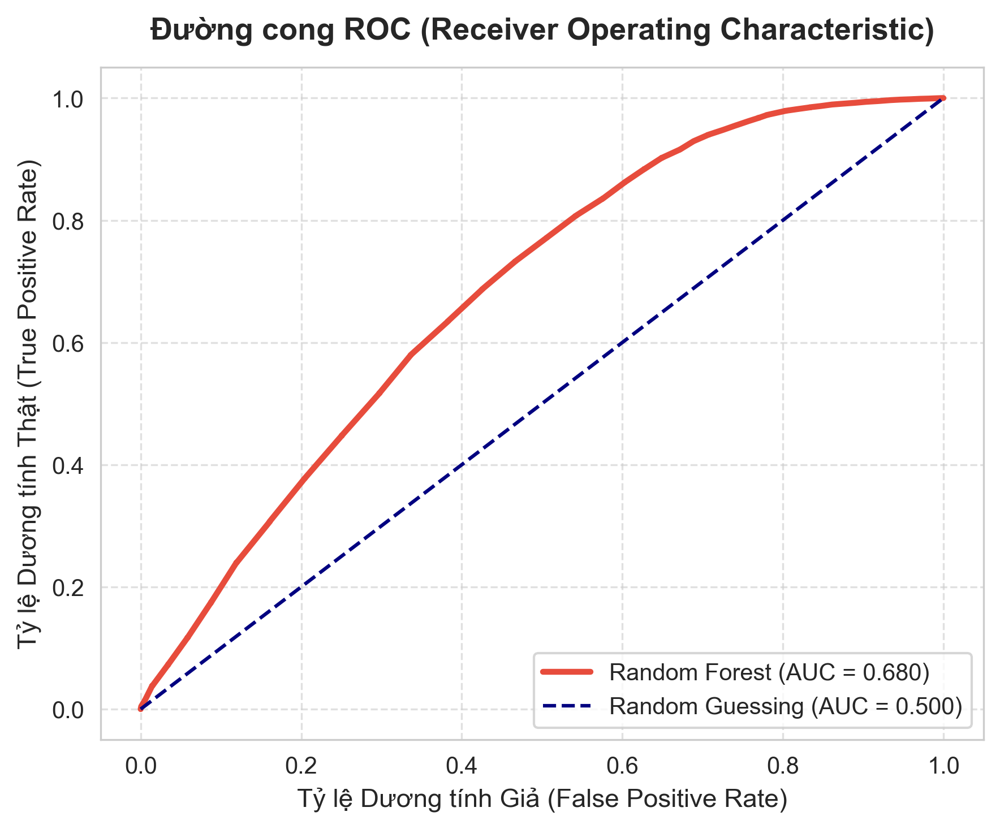

# 🤖 Báo Cáo Đánh Giá Mô Hình Machine Learning (ML Insights)

Thư mục này tổng hợp các biểu đồ trực quan hóa, kết quả đánh giá và phân tích chuyên sâu về mô hình Machine Learning được triển khai trong [`notebook/ml.ipynb`](../../notebook/ml.ipynb) trên bộ dữ liệu thương mại điện tử Olist.

---

## 📑 Mục Lục
1. [Bài Toán & Mục Tiêu Dự Đoán](#1-bài-toán--mục-tiêu-dự-đoán-problem-statement)
2. [Thuật Toán & Quy Trình Huấn Luyện](#2-thuật-toán--quy-trình-huấn-luyện-pipeline)
3. [Tối Ưu Siêu Tham Số (Hyperparameter Tuning)](#3-tối-ưu-siêu-tham-số-hyperparameter-tuning)
4. [Đánh Giá Hiệu Năng Toàn Diện (Model Evaluation)](#4-đánh-giá-hiệu-năng-toàn-diện-model-evaluation)
5. [Tầm Quan Trọng Của Đặc Trưng (Feature Importance)](#5-tầm-quan-trọng-của-đặc-trưng-feature-importance)
6. [Ứng Dụng Thực Tiễn Trong Vận Hành (Production Deployment)](#6-ứng-dụng-thực-tiễn-trong-vận-hành-production-deployment)

---

## 1. Bài Toán & Mục Tiêu Dự Đoán (Problem Statement)

- **Mục tiêu**: Dự đoán sớm mức độ hài lòng của khách hàng đối với đơn hàng thương mại điện tử (Phân loại nhị phân: **Không hài lòng (< 4 sao)** vs **Hài lòng ($\ge$ 4 sao)**).
- **Ý nghĩa kinh doanh**:
  - Phát hiện kịp thời các đơn hàng có rủi ro cao bị đánh giá tiêu cực (1-2 sao) ngay trong quá trình vận chuyển.
  - Kích hoạt cơ chế chăm sóc khách hàng chủ động, cảnh báo nhà vận chuyển (*3PL Carrier*) và giảm tỷ lệ hoàn đơn/khiếu nại.

---

## 2. Thuật Toán & Quy Trình Huấn Luyện (Pipeline)

- **Mô hình**: **Random Forest Classifier** (Tập hợp cây quyết định *Ensemble of Decision Trees*).
- **Tiền xử lý & Trích xuất đặc trưng**:
  - Tính toán thời gian vận chuyển thực tế, độ trễ so với dự kiến (`delivery_delay_days`).
  - Tỷ lệ cước vận chuyển trên tổng giá trị hàng hóa (`freight_ratio`).
  - Khoảng cách địa lý giữa người bán và người mua.
  - Số lượng mặt hàng (`order_item_count`), số kỳ trả góp (`payment_installments`).
  - Cân bằng dữ liệu (Class Imbalance Resampling) trên tập huấn luyện.

---

## 3. Tối Ưu Siêu Tham Số (Hyperparameter Tuning)

| Đồ Thị Độ Chính Xác Theo Số Lượng Cây (Accuracy vs Trees) |
| :---: |
|  |

### 💡 Insights:
- Đồ thị đánh giá hiệu năng theo số lượng cây (`n_estimators`) cho thấy mô hình nhanh chóng hội tụ và đạt độ ổn định cao khi số lượng cây đạt từ 100 đến 200 cây.
- Lựa chọn tham số tối ưu giúp cân bằng giữa độ chính xác dự báo và chi phí tài nguyên tính toán khi huấn luyện.

---

## 4. Đánh Giá Hiệu Năng Toàn Diện (Model Evaluation)

### 📊 Bảng Chỉ Số Đo Lường (Classification Metrics)

| Chỉ số (Metric) | Không hài lòng (< 4 sao) | Hài lòng ($\ge$ 4 sao) | Toàn cục (Overall) |
| :--- | :---: | :---: | :---: |
| **Precision** | 0.57 | 0.83 | 0.78 (Weighted) |
| **Recall** | 0.29 | 0.94 | 0.80 (Weighted) |
| **F1-Score** | 0.39 | 0.88 | 0.78 (Weighted) |
| **Độ chính xác (Accuracy)** | — | — | **80.37%** |

---

### 🔍 Ma Trận Nhầm Lẫn & Đường Cong ROC

| Ma Trận Nhầm Lẫn (Confusion Matrix) | Đường Cong ROC & Điểm AUC (ROC Curve) |
| :---: | :---: |
|  |  |

### 💡 Phân Tích Kết Quả:
- **Độ chính xác toàn cục đạt 80.37%**, chứng minh khả năng tổng quát hóa tốt của mô hình trên tập kiểm thử độc lập (`test_set`).
- **Độ đặc hiệu cao đối với nhóm khách hàng hài lòng (Recall = 94%)**: Mô hình dự đoán chuẩn xác đại đa số các giao dịch thành công không gặp sự cố.
- **Đường cong ROC & AUC**: Mô hình thể hiện khả năng phân tách tốt giữa hai nhóm nhãn so với đường dự đoán ngẫu nhiên (*Random Chance baseline*).

---

## 5. Tầm Quan Trọng Của Đặc Trưng (Feature Importance)

| Top 15 Đặc Trưng Quan Trọng Nhất (Feature Importance) |
| :---: |
|  |

### 💡 Phân Tích Các Yếu Tố Quyết Định Điểm Đánh Giá:
1. **Thời gian vận chuyển thực tế & Chênh lệch so với ngày dự kiến (`delivery_time`, `delay_days`)**: Là đặc trưng đứng đầu về trọng số quyết định. Giao hàng trễ hạn là nguyên nhân trực tiếp dẫn đến đánh giá 1-2 sao.
2. **Cước phí vận chuyển & Tỷ lệ phí ship (`freight_value`, `freight_ratio`)**: Phí ship cao so với giá trị món hàng tạo tâm lý kỳ vọng khắt khe hơn từ người tiêu dùng.
3. **Giá trị sản phẩm & Tổng thanh toán (`price`, `payment_value`)**: Đơn hàng giá trị cao thường đòi hỏi dịch vụ đóng gói và tốc độ phản hồi CSKH tương xứng.
4. **Khoảng cách địa lý giữa Seller và Customer**: Ảnh hưởng gián tiếp qua thời gian trung chuyển giữa các bang.

---

## 6. Ứng Dụng Thực Tiễn Trong Vận Hành (Production Deployment)

1. **Hệ Thống Cảnh Báo Sớm (Early Warning System - EWS)**:
   - Tích hợp model vào hệ thống quản lý đơn hàng (OMS). Khi đơn hàng vượt ngưỡng thời gian quy định hoặc chuyển trạng thái trễ hạn, hệ thống tự động gắn nhãn rủi ro cao (*High Risk*).
2. **Hành Động Can Thiệp Chủ Động (Proactive Customer Support)**:
   - Gửi SMS / Email xin lỗi kèm mã giảm giá bù đắp trước khi khách hàng nhận được hàng trễ.
   - Thúc đẩy đơn vị vận chuyển ưu tiên xử lý các đơn hàng đang nằm trong vùng cảnh báo.
3. **Cải Tiến Mô Hình Trong Tương Lai**:
   - Thử nghiệm các thuật toán tăng cường độ dốc (XGBoost, LightGBM, CatBoost) kết hợp kỹ thuật Threshold Moving để tối ưu chỉ số Recall cho nhóm không hài lòng.
